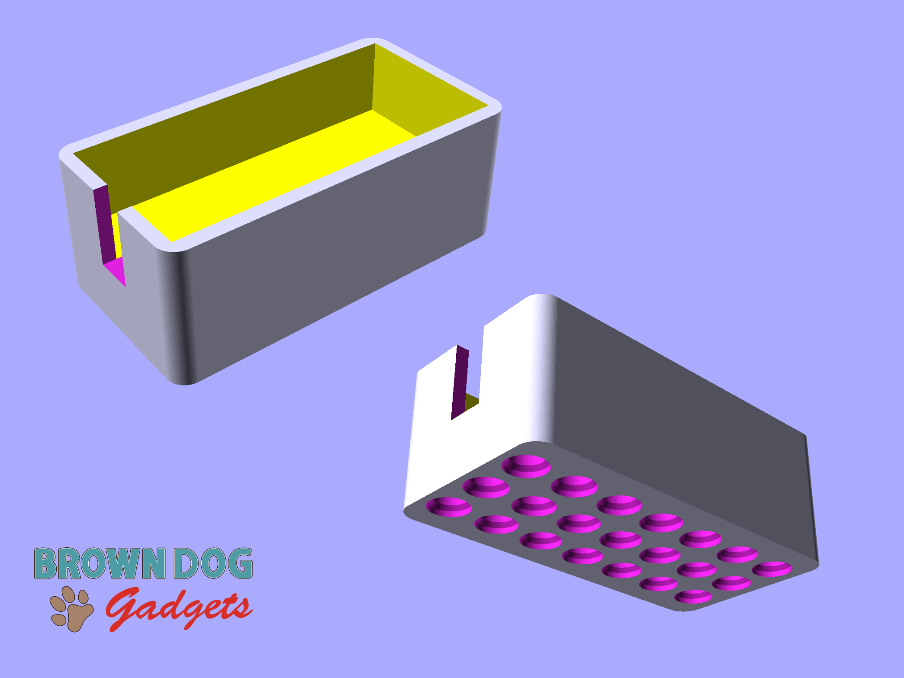

# 2AAA Battery Holder with Holes

This is a LEGO Technic compatible file that holds a [2AAA Battery Holder](https://www.browndoggadgets.com/products/aaa-battery-holder-double) for mounting onto LEGO Technic parts.

There are two versions. The **Tall** version hides the battery pack better, and the **Short** version will print a bit quicker and use less material.

The battery pack sits inside the holder loosely. If you want a more secure fit you can add some double-sided tape or a loop of tape to hold the battery pack into place.

This file can be printed on a standard FFF (Fused Filament Fabrication) desktop printer without support.

---

Brown Dog Gadgets

https://www.browndoggadgets.com/
