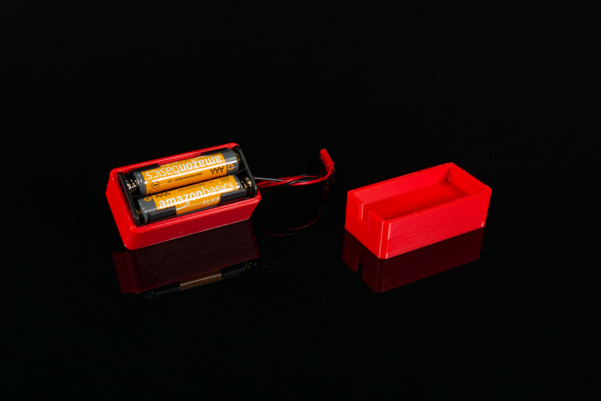

# 2AAA Battery Holder with Holes

This is the Battery Holder for our [Rover Remote Kit](https://www.browndoggadgets.com/products/rover-remote-kit). It is a Technic compatible component that holds a 2AAA Battery Holder for mounting onto LEGO Technic parts.

There are two versions. The **Short** is the one we use in the kit. It's a bit smaller and will print in less time. The **Tall** one was an earlier version we experimented with.

The battery pack sits inside the holder loosely. If you want a more secure fit you can add some double-sided tape or a loop of tape to hold the battery pack into place.

This file can be printed on a standard FFF (Fused Filament Fabrication) desktop printer without support.

---

Brown Dog Gadgets

https://www.browndoggadgets.com/
