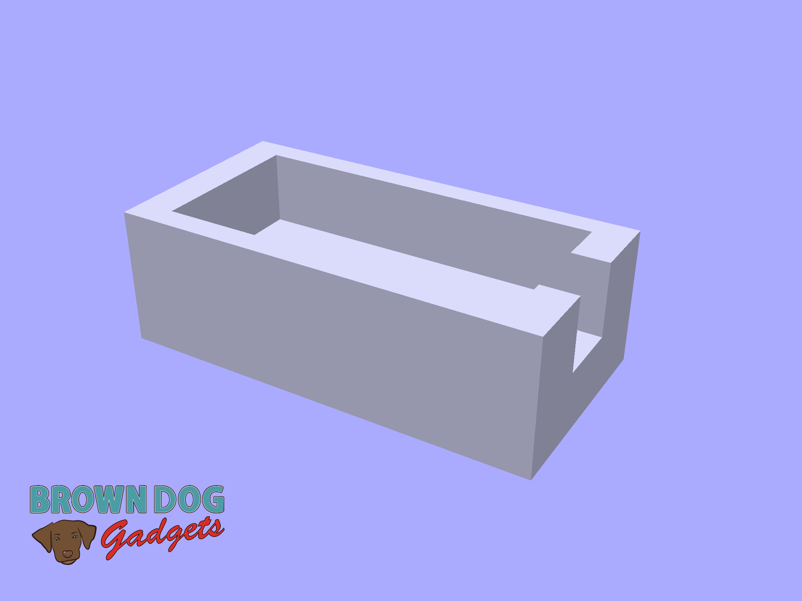
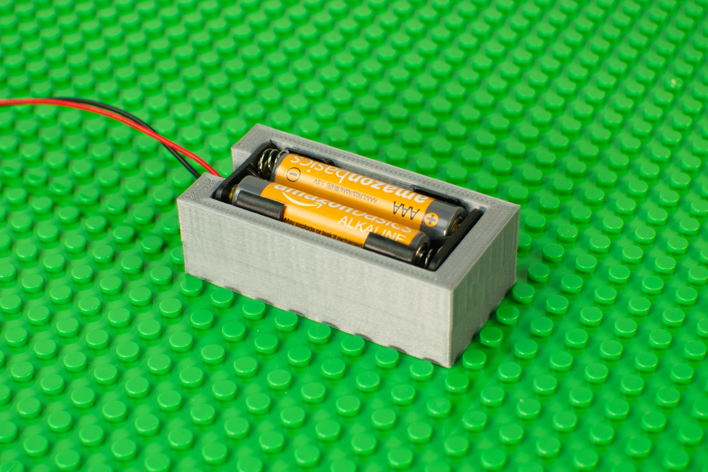

# 2AAA Battery Holder

This is a LEGO compatible file that holds a [2AAA Battery Holder](https://www.browndoggadgets.com/products/aaa-battery-holder-double) for mounting onto a LEGO baseplate or bricks.

The battery pack sits inside the holder loosely. If you want a more secure fit you can add some tape to hold the battery pack into place.

This file can be printed on a standard FFF (Fused Filament Fabrication) desktop printer without support.

---

Brown Dog Gadgets

https://www.browndoggadgets.com/
