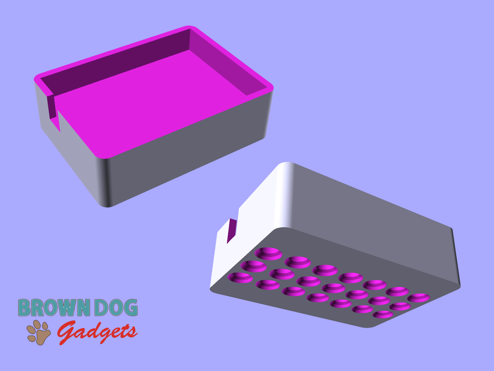

# 3AAA Battery Holder with Holes

This is a LEGO Technic compatible file that holds a 3AAA Battery Holder for mounting onto LEGO Technic parts.

The battery pack sits inside the holder loosely. If you want a more secure fit you can add some double-sided foam tape or a loop of tape to hold the battery pack into place.

This file can be printed on a standard FFF (Fused Filament Fabrication) desktop printer without support.

---

Brown Dog Gadgets

https://www.browndoggadgets.com/
