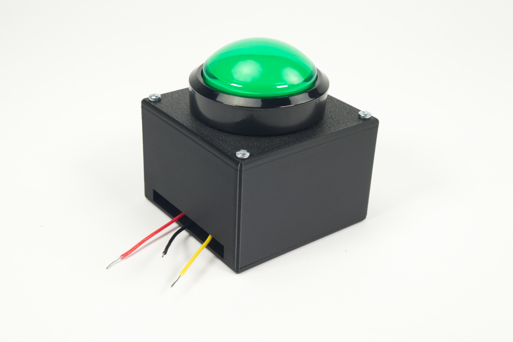
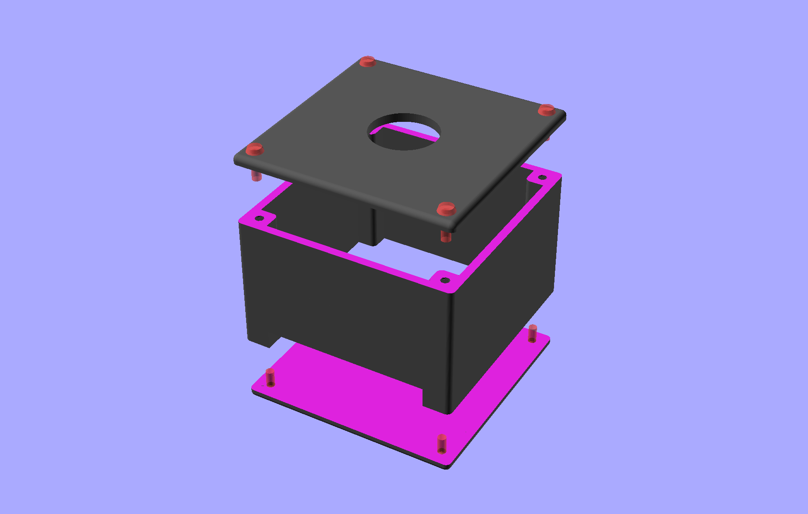
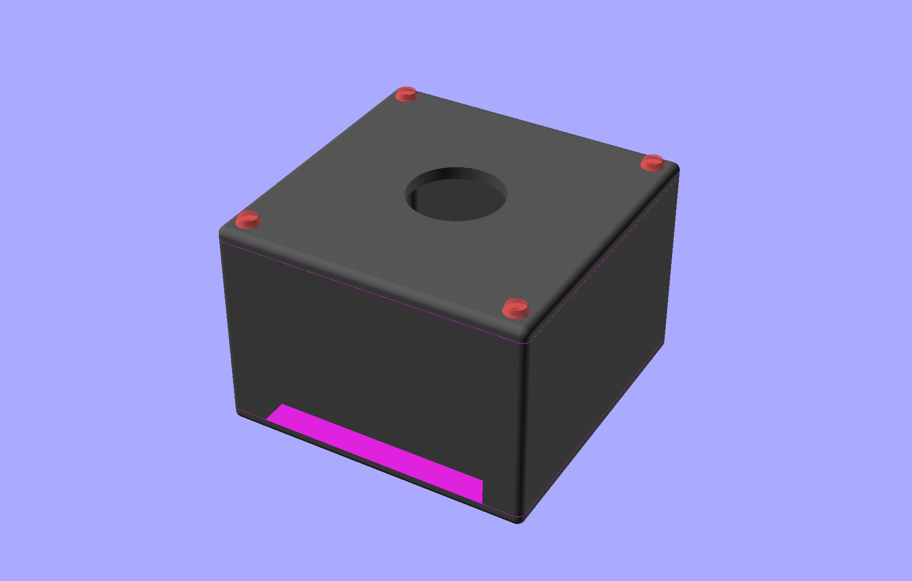

# Arcade Button Enclosure

These files can be used to create an enclosure for an arcade button.

We use this to make arcade buttons Maker Tape compatible by adding wires for easy connection points.

See the full guide for assembly and use instructions: [Arcade Button Enclosure](https://learn.browndoggadgets.com/Guide/Arcade+Button+Enclosure/627)

These files can be printed on a standard FFF (Fused Filament Fabrication) desktop printer without support.

Check out our other [3D Printed Parts](https://learn.browndoggadgets.com/c/3D_Printed_Parts) as well.

---

Brown Dog Gadgets

https://www.browndoggadgets.com/
