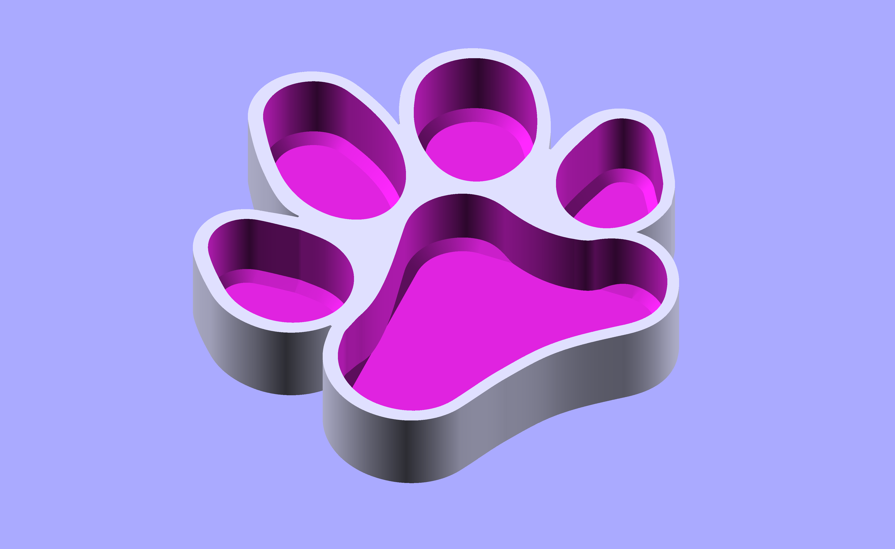
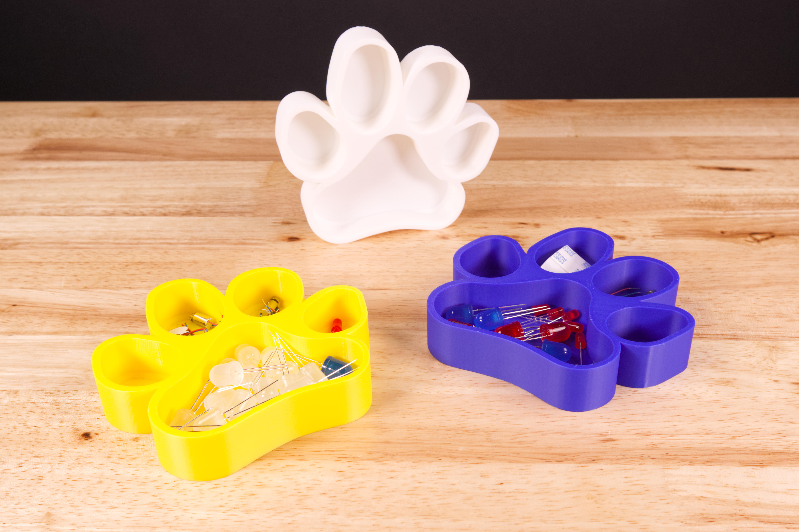
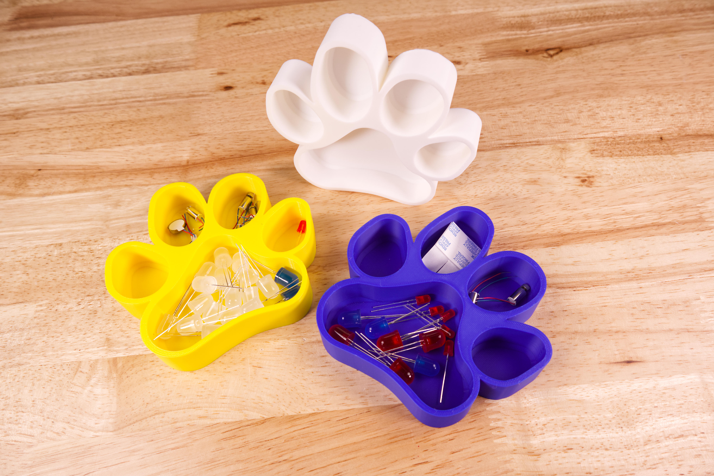
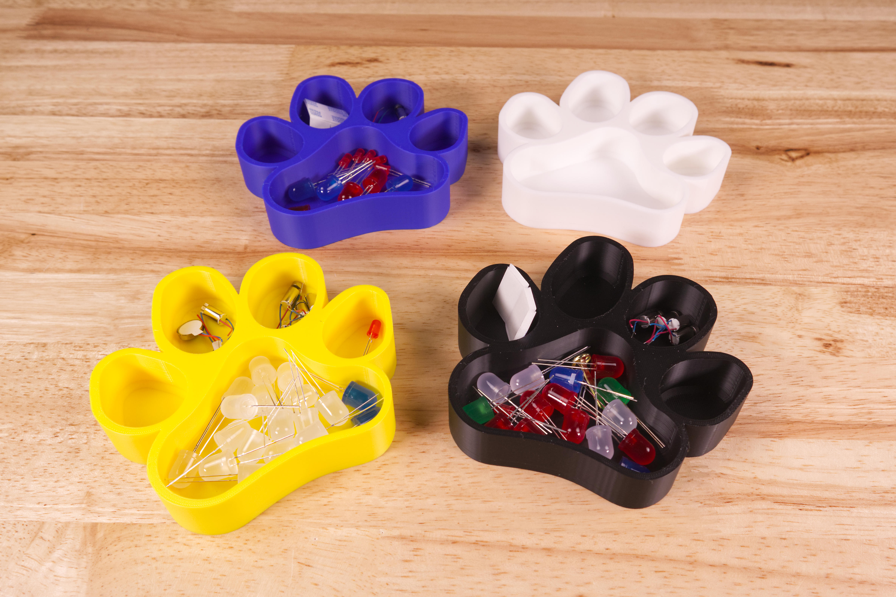

# BDG Paw Tray

The BDG Paw Tray is a fun little tray to keep components organized. It's modeled after the paw print in the Brown Dog Gadgets logo.

You can scale this model to different sizes if needed. 

These files can be printed on a standard FFF (Fused Filament Fabrication) desktop printer without support.

Check out our other [3D Printed Parts](https://learn.browndoggadgets.com/c/3D_Printed_Parts) as well.

  
---
  
Brown Dog Gadgets  
https://www.browndoggadgets.com/
  