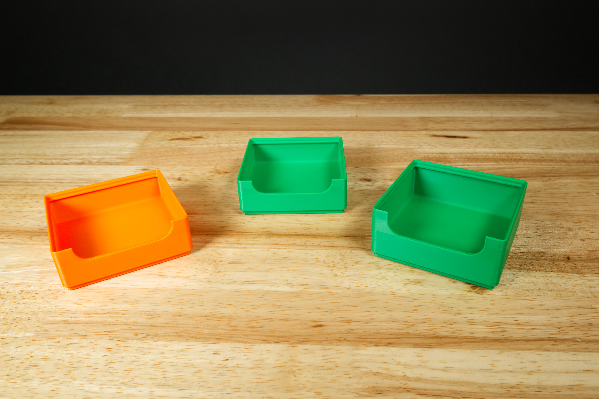
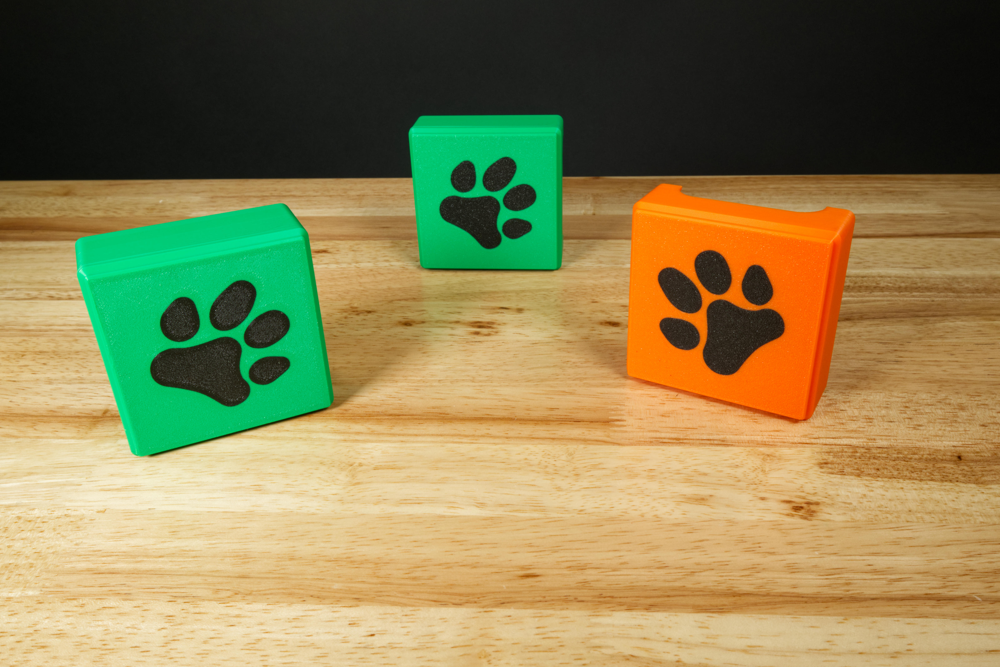
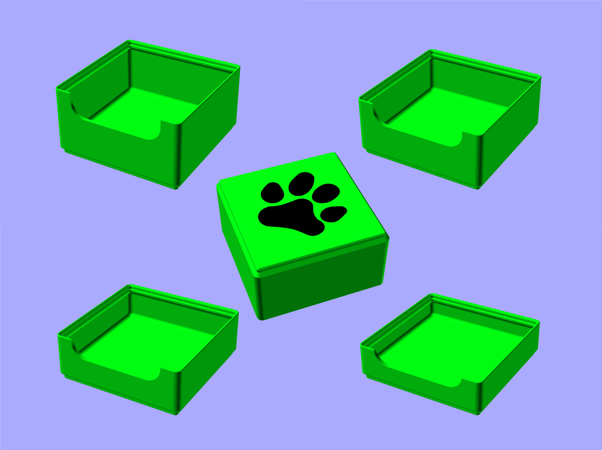
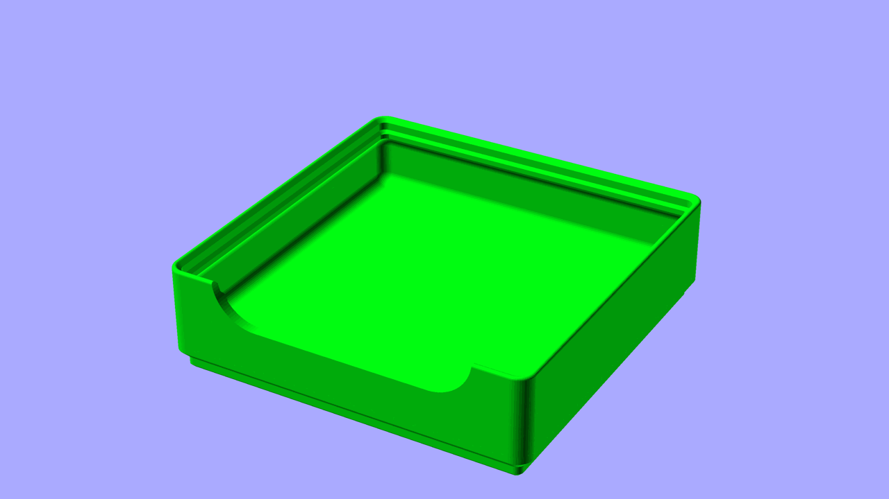

# BDG Parts Bin

These files can be printed to create a set of stackable bins.

See the full guide for assembly and use instructions: [BDG Parts Bins](https://learn.browndoggadgets.com/Guide/BDG+Parts+Bins/685)

These files can be printed on a standard FFF (Fused Filament Fabrication) desktop printer without support.

Check out our other [3D Printed Parts](https://learn.browndoggadgets.com/c/3D_Printed_Parts) as well.

**Note:** We based these bins on some of the code from [Gridfinity Rebuilt](https://kennetek.github.io/gridfinity-rebuilt-openscad/).

---

Brown Dog Gadgets

https://www.browndoggadgets.com/
