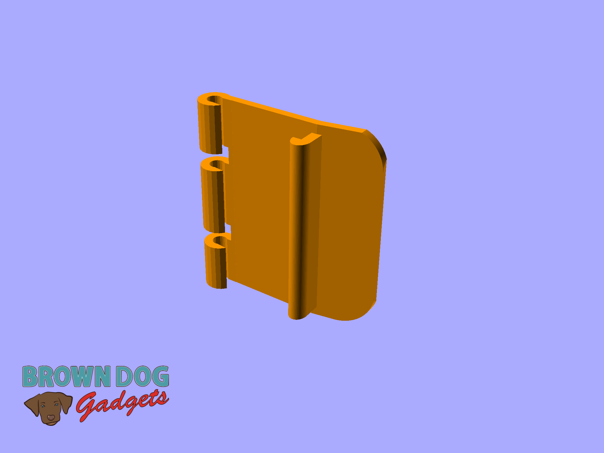
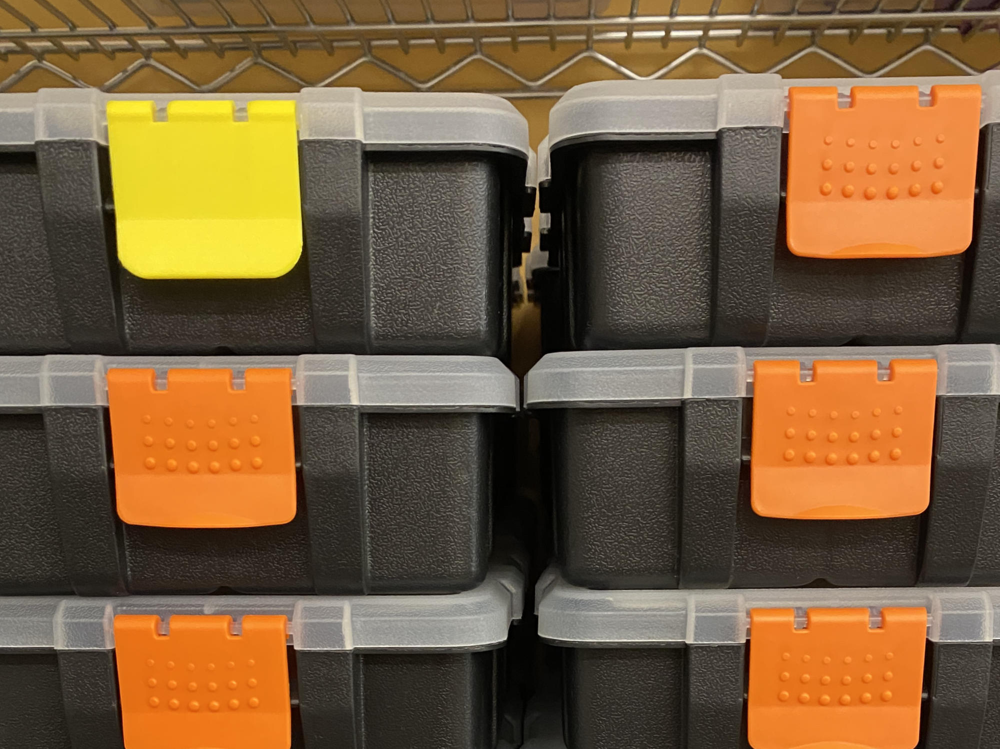
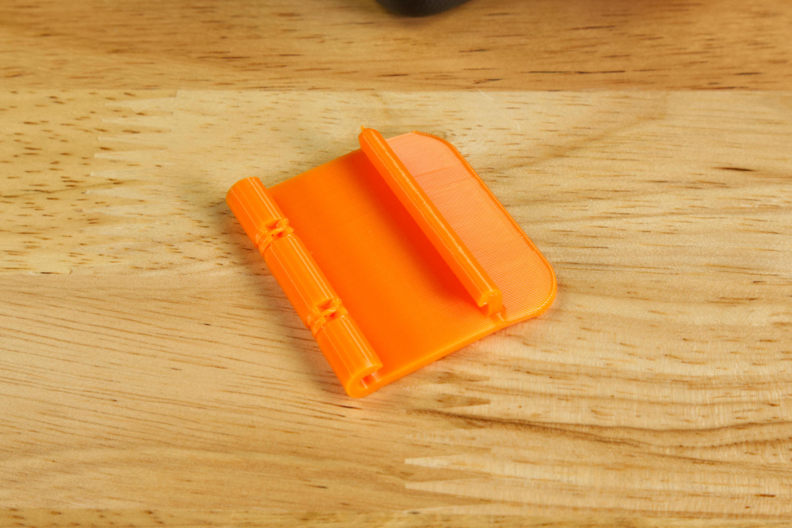
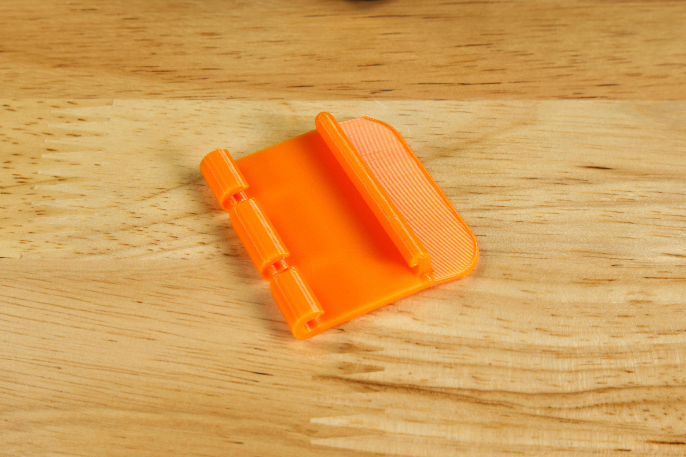
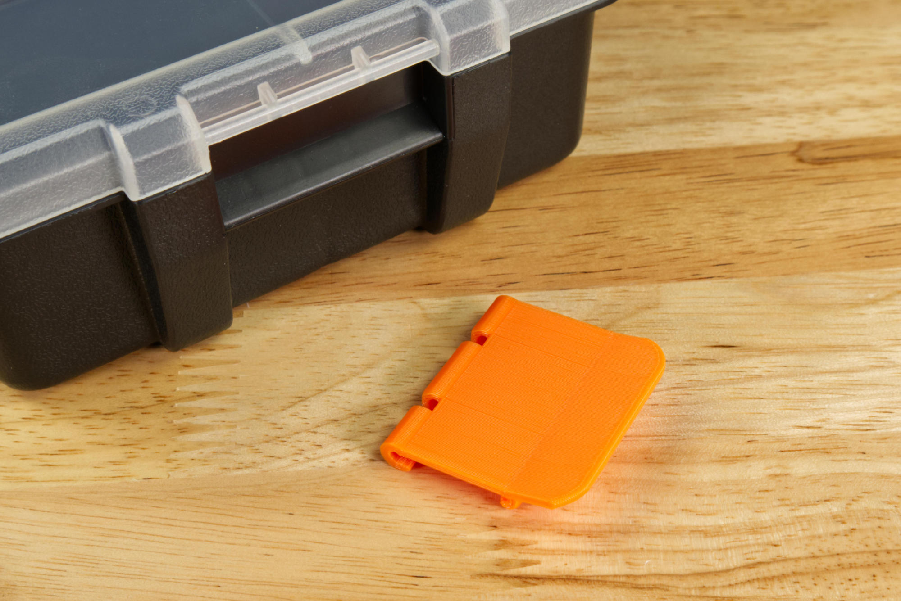
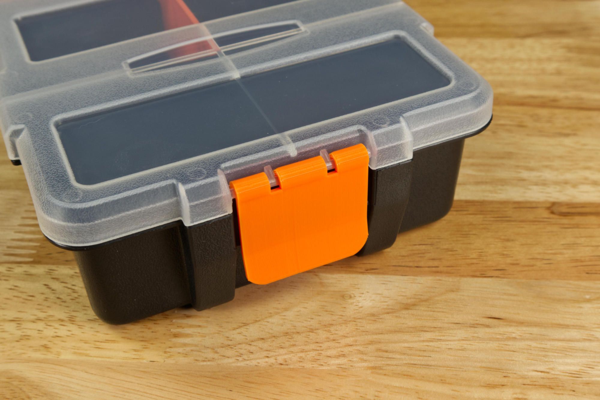

# Box Latch

Here's a replacement box latch in case you lose one from the boxes our Crazy Circuits Kits come in.

A teacher said they lost a latch so they created a 3D model and sent it to use in case anyone else loses one.

This file can be printed on a standard FFF (Fused Filament Fabrication) desktop printer with supports enabled. You'll want to print it standing on end as shown in the first image. (Make sure you remove supports before use!)

---

Brown Dog Gadgets

https://www.browndoggadgets.com/
