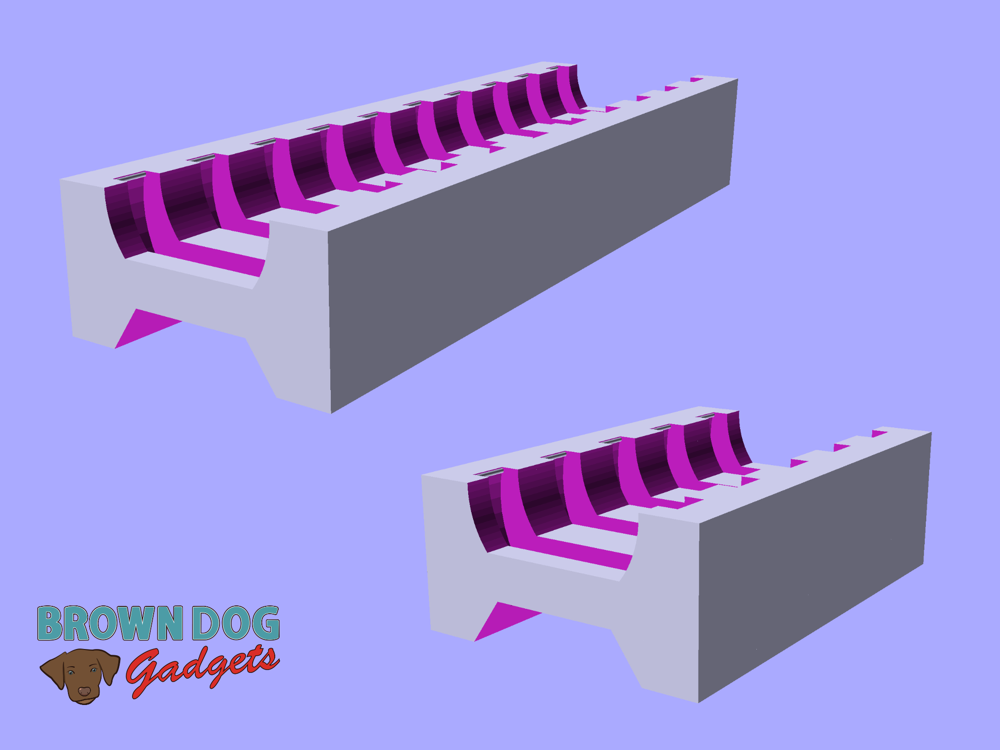

# CR2032 Battery Holder

This CR2032 Battery Holder is a safe way to store coin cell batteries. 

The batteries snap into the holder but can be easily removed by pressing on the battery from the bottom of the holder to pop it out.

There is a version that holds 10 batteries, and a version that holds 5 batteries. If you want some other quantity you can edit the .scad file.

Note: You should never dump a handfull of coin cell batteries into a container or a pocket as they can short out when touching each other.

This file can be printed on a standard FFF (Fused Filament Fabrication) desktop printer without support.

---

Brown Dog Gadgets

https://www.browndoggadgets.com/
