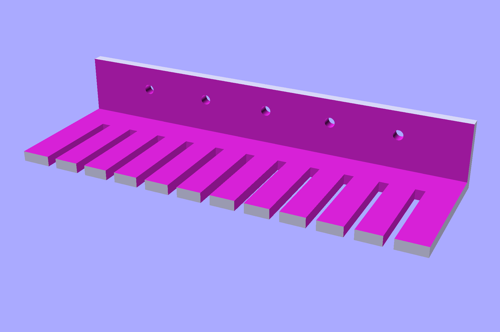
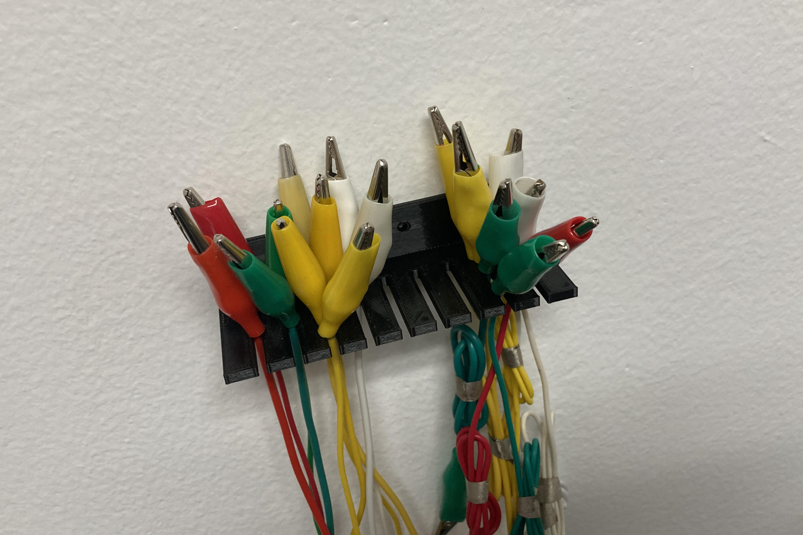
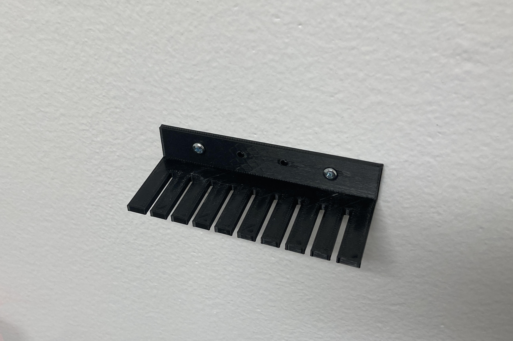
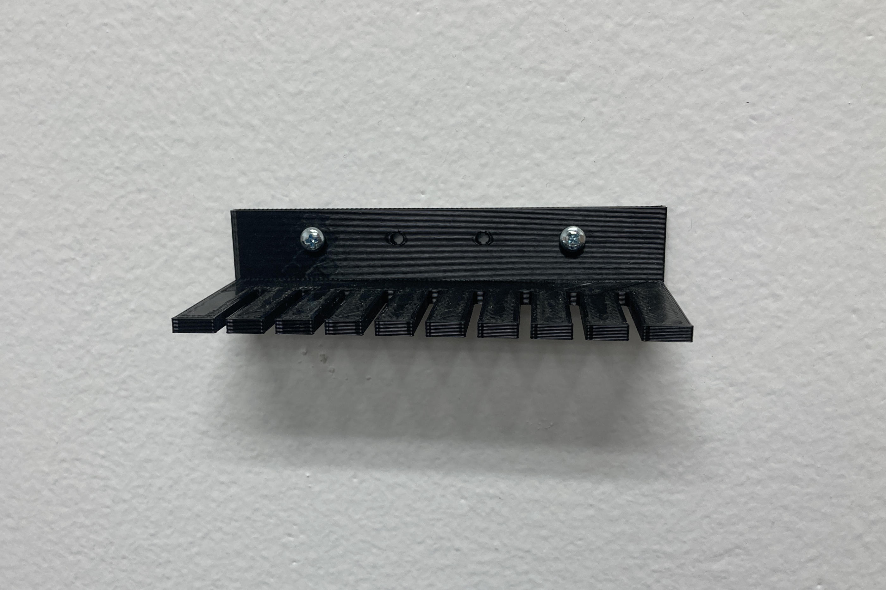

# Cable Rack

We needed a quick and easy way to hang up some alligator clips so we designed this Cable Rack.

There are a few different sized examples included...

The [OpenSCAD](https://openscad.org/) file is also included, and it is a parametric design, so you can make edits to the dimensions, the slots, the holes, etc.

This file can be printed on a standard FFF (Fused Filament Fabrication) desktop printer without support.

---

Brown Dog Gadgets

https://www.browndoggadgets.com/
