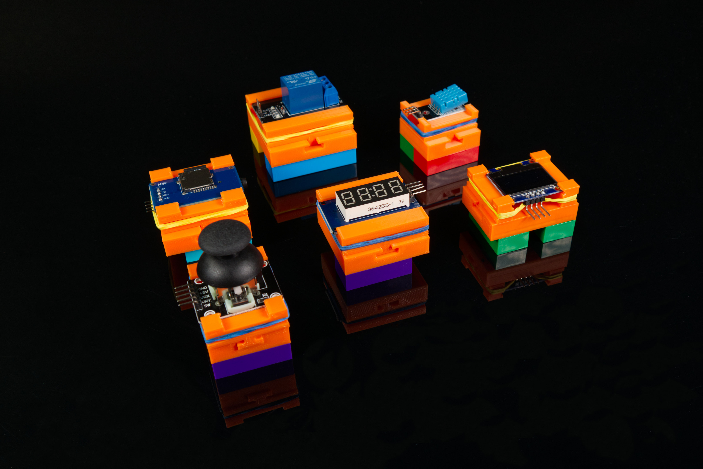

# Component Holder

This is an example of a Component Holder that can be used to make generic components "LEGO Brick" compatible.

The included example file is 5x5 but if you want to make a custom size see the guide: [3D Printed Component Holder](https://learn.browndoggadgets.com/Guide/3D+Printed+Component+Holder/578)

Alternately, check out our other parts for a specific sized holder: [3D Printed Parts by Brown Dog Gadgets](https://learn.browndoggadgets.com/c/3D_Printed_Parts)

These files can be printed on a standard FFF (Fused Filament Fabrication) desktop printer without support.

---

Brown Dog Gadgets

https://www.browndoggadgets.com/
