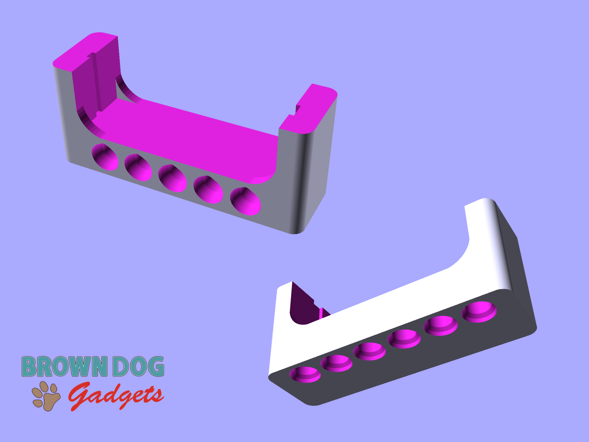

# Distance Sensor Holder with Holes

This is the Distance Sensor Holder for our [Bit Board Rover Kit](https://www.browndoggadgets.com/products/bit-board-rover). It is a Technic compatible component that holds a [Distance Sensor](https://www.browndoggadgets.com/products/distance-sensor) for mounting onto LEGO Technic parts.

The Distance Sensor slides into the holder and is held in place by gravity.

This file can be printed on a standard FFF (Fused Filament Fabrication) desktop printer without support.

---

Brown Dog Gadgets

https://www.browndoggadgets.com/
