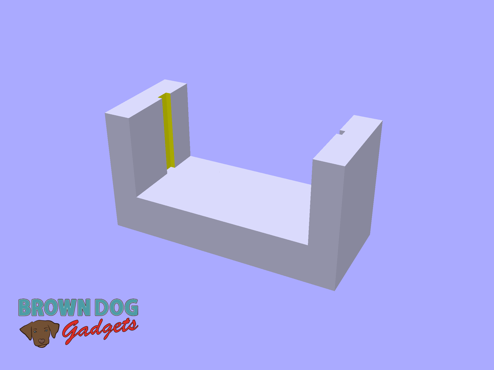

# Distance Sensor Holder

This is a LEGO compatible file that holds a [Distance Sensor](https://www.browndoggadgets.com/products/distance-sensor) for mounting onto a LEGO baseplate or bricks.

The Distance Sensor slides into the holder and is held in place by gravity.

This file can be printed on a standard FFF (Fused Filament Fabrication) desktop printer without support.

---

Brown Dog Gadgets

https://www.browndoggadgets.com/
