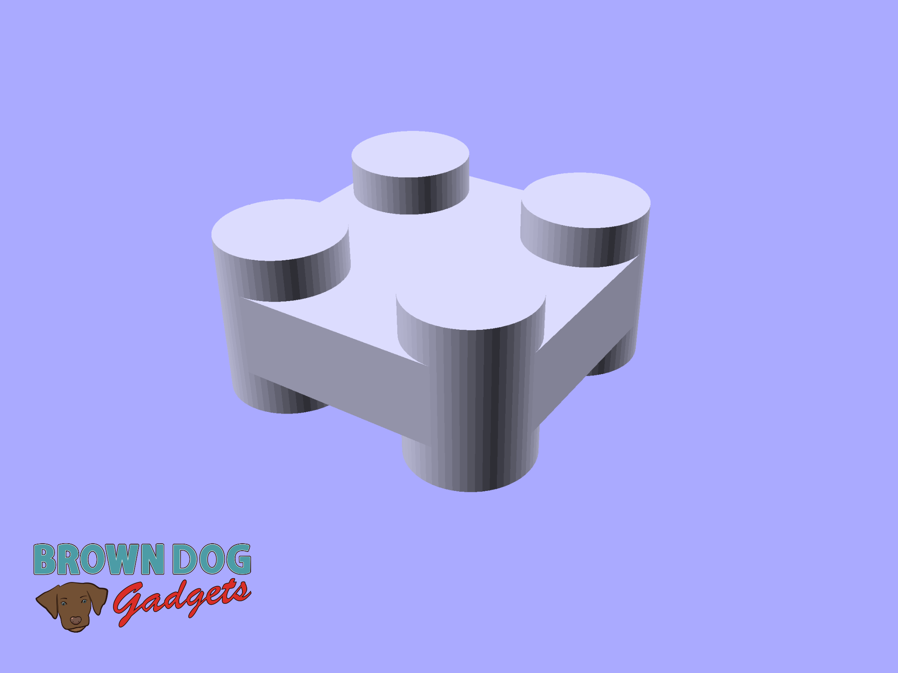
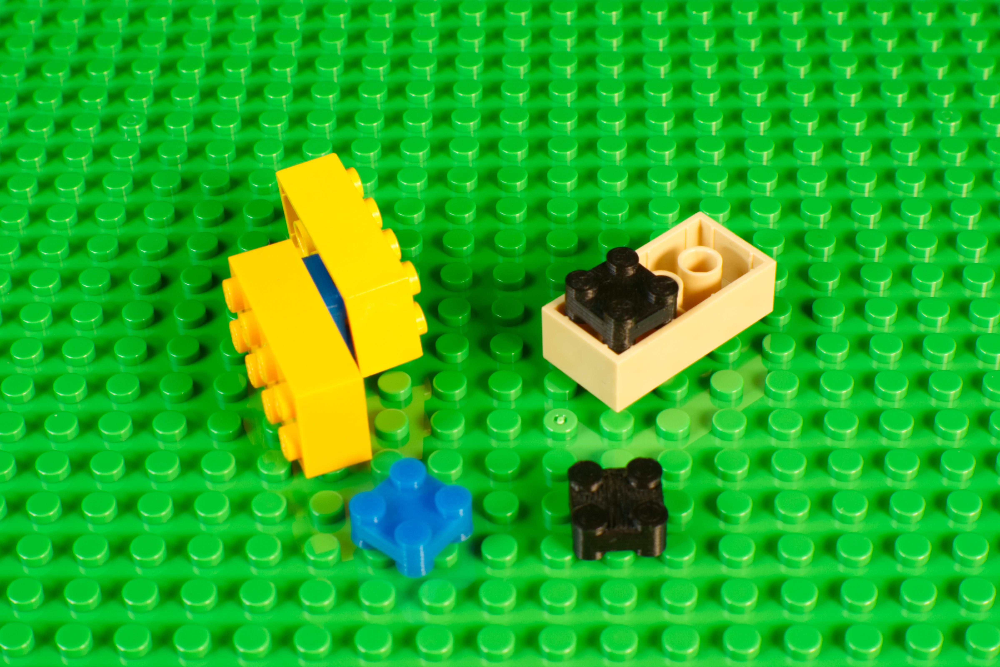

# Double Sided 2x2 LEGO

This is a LEGO compatible file that allows you to connect two LEGO parts together via their bottom sides.

This file can be printed on a standard FFF (Fused Filament Fabrication) desktop printer without support.

**Note:** We designed this so we could add Crazy Circuits LEDs to the bottom on LEGO projects.

**Tip:** If the file does not have a tight fit you can try to print it a bit more than 100% scale. Try it at 101%, if it is still loose, increase to 102%, and so on.

---

Brown Dog Gadgets

https://www.browndoggadgets.com/
