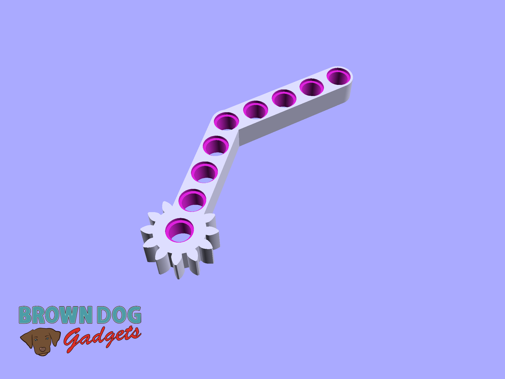
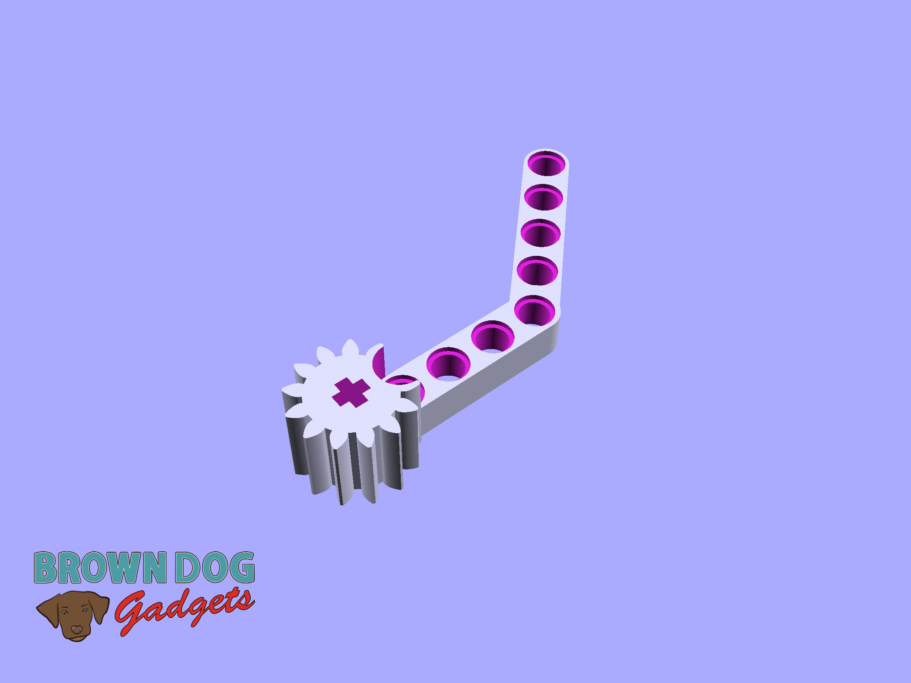
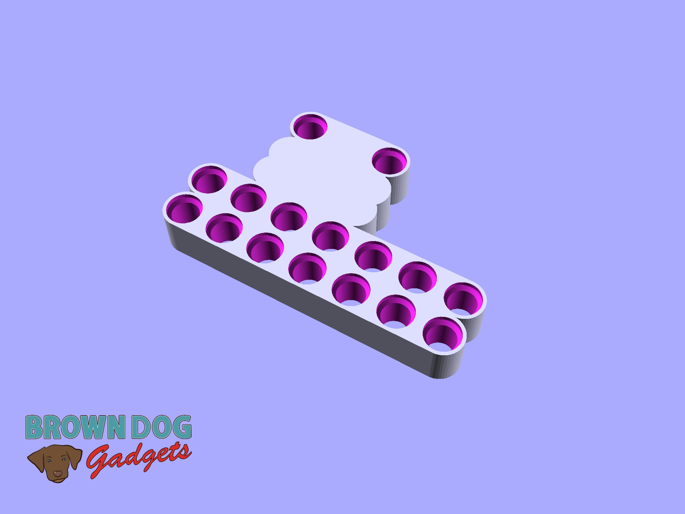
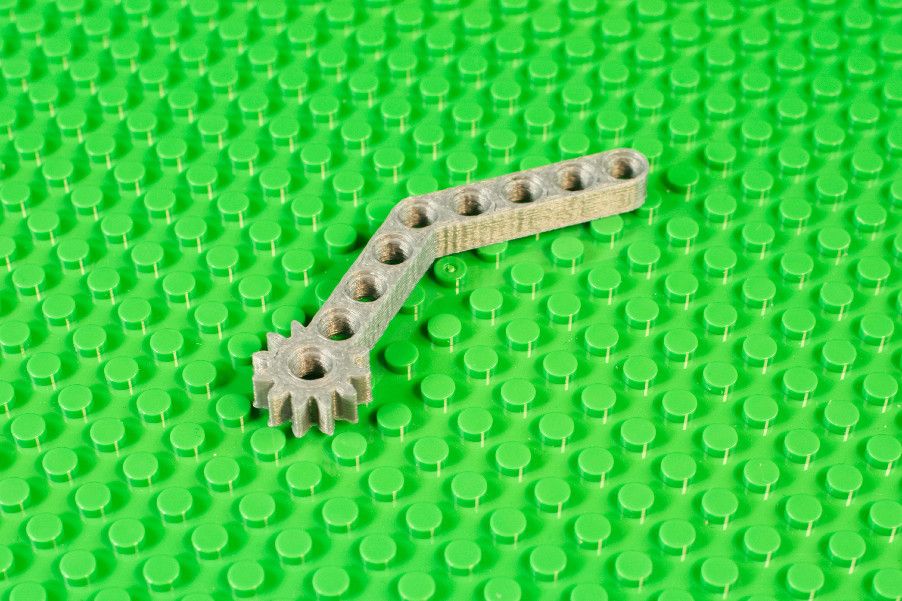
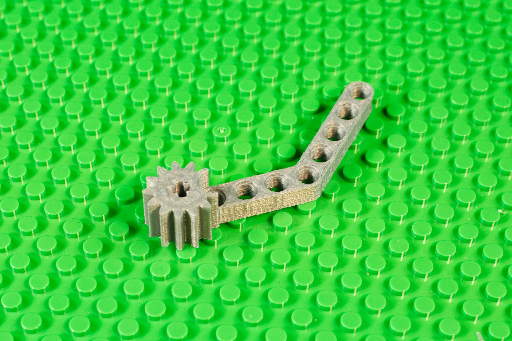
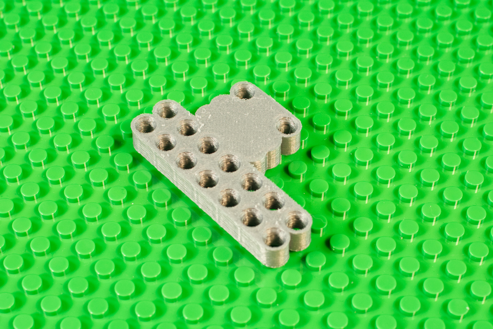

# Gripper

These parts can be used (along with some LEGO parts) to make a LEGO Gripper that is activated by a [LEGO Compatible 270 Degree Servo](https://www.browndoggadgets.com/collections/tbm/products/lego-compatible-270-degree-servo).

There is a full guide available on our web site: [LEGO Gripper (with 3D Printed Parts)](https://browndoggadgets.dozuki.com/Guide/LEGO+Gripper+(with+3D+Printed+Parts)/327)

These files can be printed on a standard FFF (Fused Filament Fabrication) desktop printer without support.

---

Brown Dog Gadgets

https://www.browndoggadgets.com/
