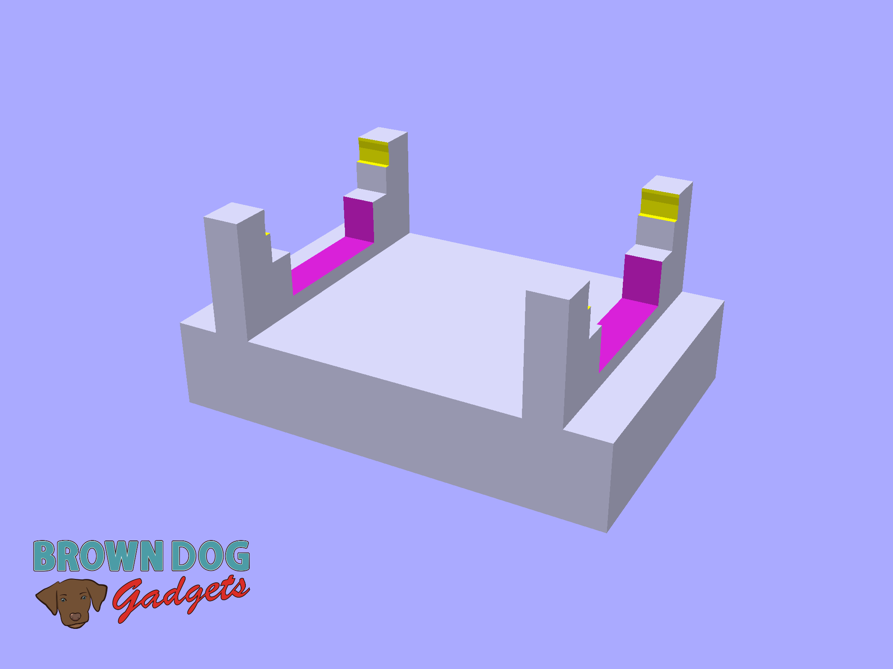
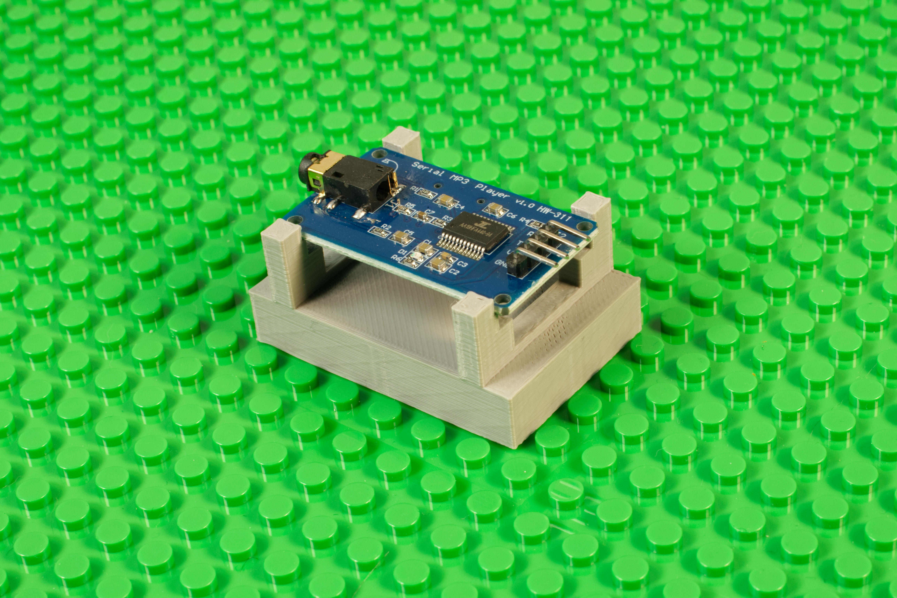

# MP3 Player Holder

This is a LEGO compatible file that holds an [MP3 Player Module](https://www.amazon.com/dp/B01JCI23JG/) for mounting onto a LEGO baseplate or bricks.

The MP3 Player Module is placed into the holder by putting one edge into the bottom holder arms and then gently pressing the opposite edge into the top holder arms.

This file can be printed on a standard FFF (Fused Filament Fabrication) desktop printer without support.

**Note:** The MP3 Player Module can be flipped so the SD Card Holder is on the top or the bottom.

---

Brown Dog Gadgets

https://www.browndoggadgets.com/
