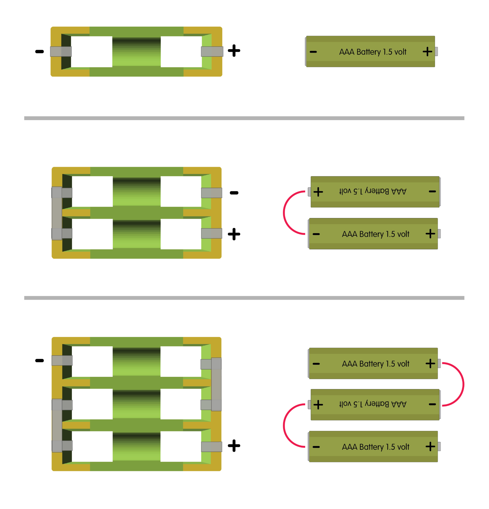
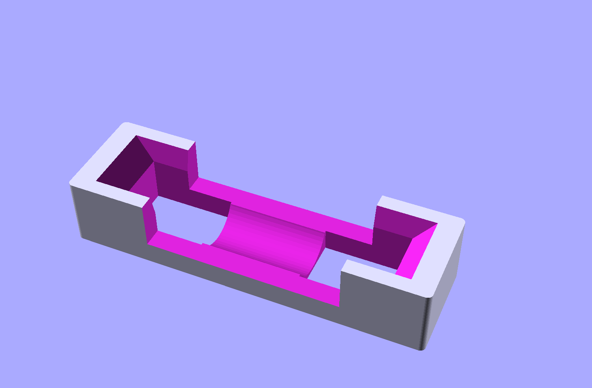
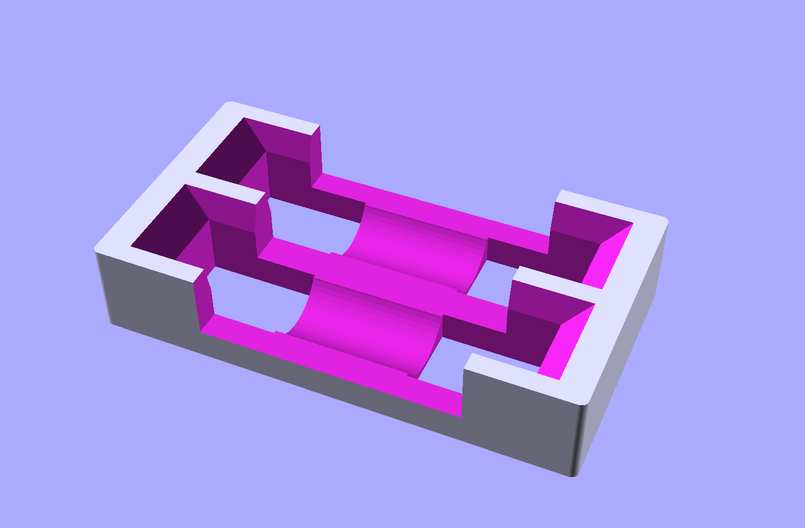
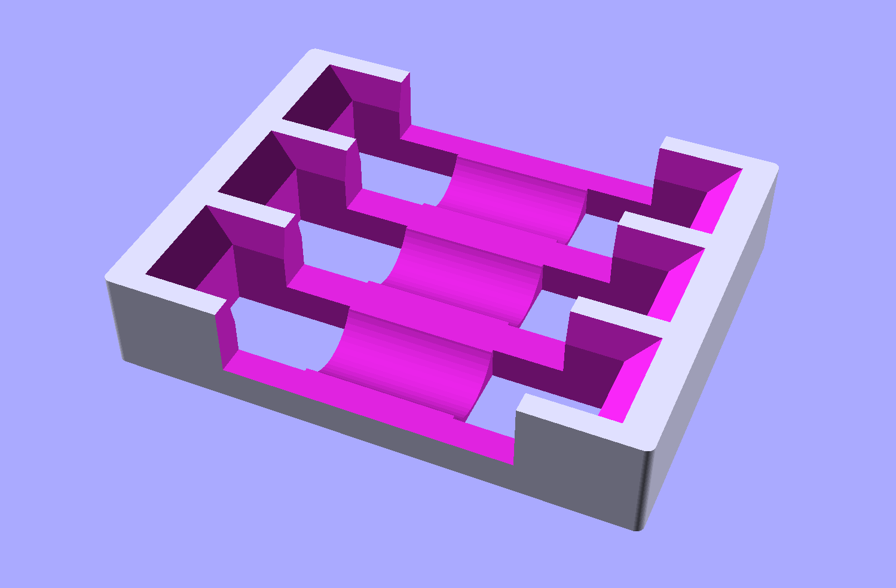
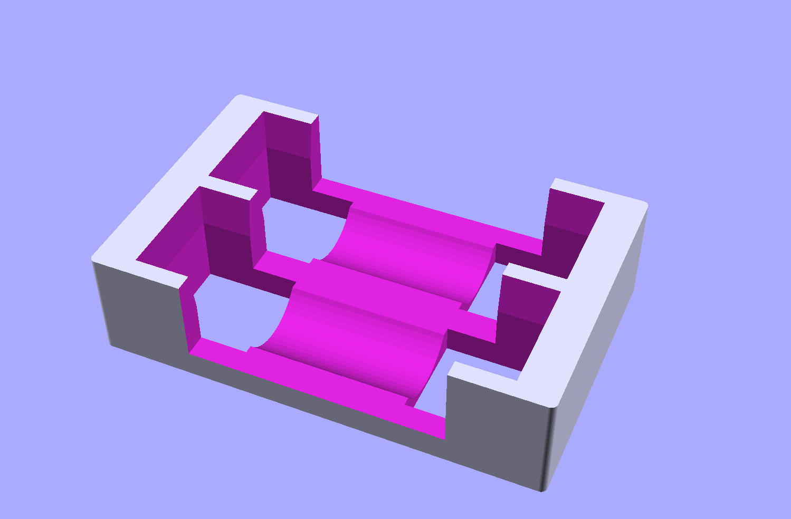

# Maker Tape Battery Holders

These are files to print your own battery holders that you can connect electrically using Maker Tape, our nylon conductive tape for creating circuits.

For the single battery holder you will need to add 1/4" Maker Tape to each end to create a positive and negative terminal. 

For multiple battery holders you will need add Maker Tape to connect the batteries in series, with a positive and negative terminal at the ends of the electrical path. (See diagram below.)

**Note!** _These are for educational use and may not be suitable for permanent circuits or applications._

**Warning!** _Electrically shorting the conductive tape can result in burning of the tape and melting of the plastic. We recommend storing these with the batteries removed, and being very careful with the battery packs when batteries are inserted._

This file can be printed on a standard FFF (Fused Filament Fabrication) desktop printer without support.

## Path of Electrical Current

## AAA Holders (1, 2, and 3 battery versions)

## AA Holders (1, 2, and 3 battery versions)

---

Brown Dog Gadgets

https://www.browndoggadgets.com/
