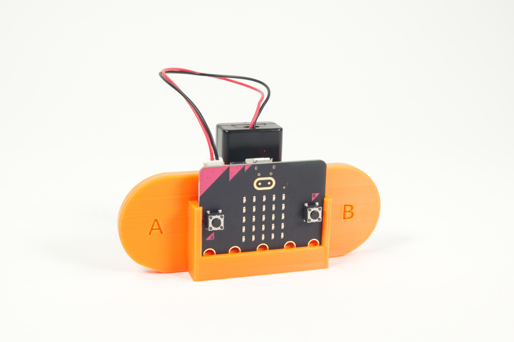
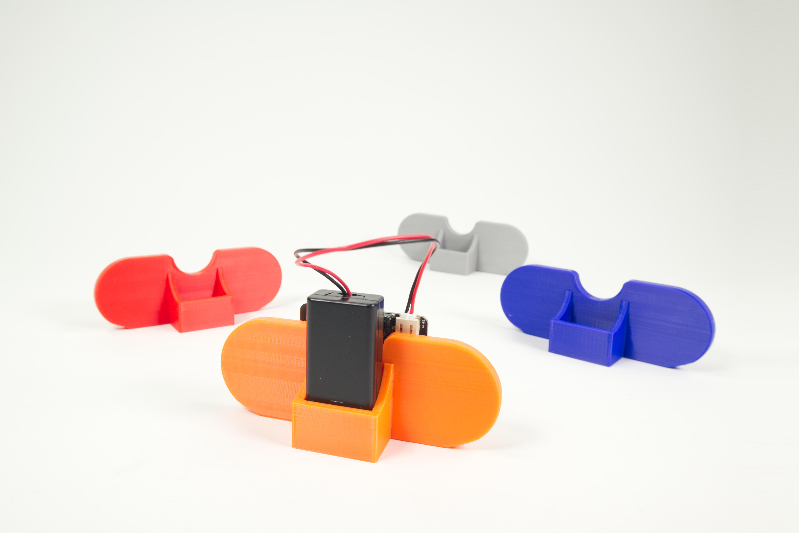
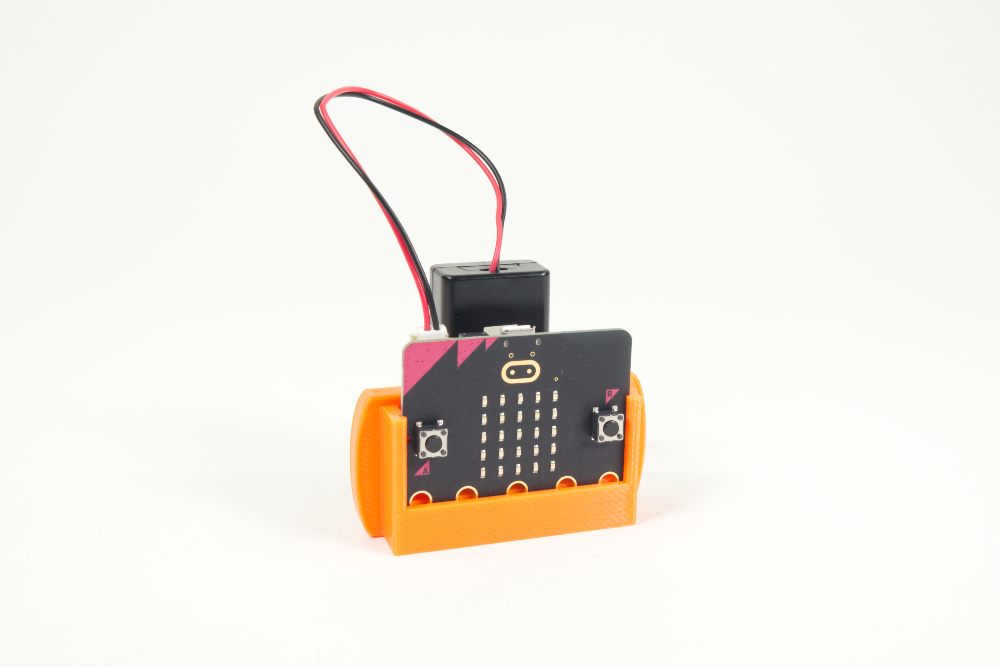
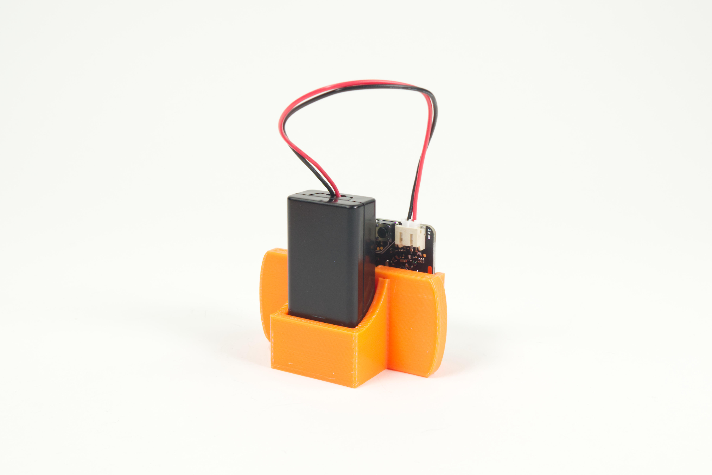
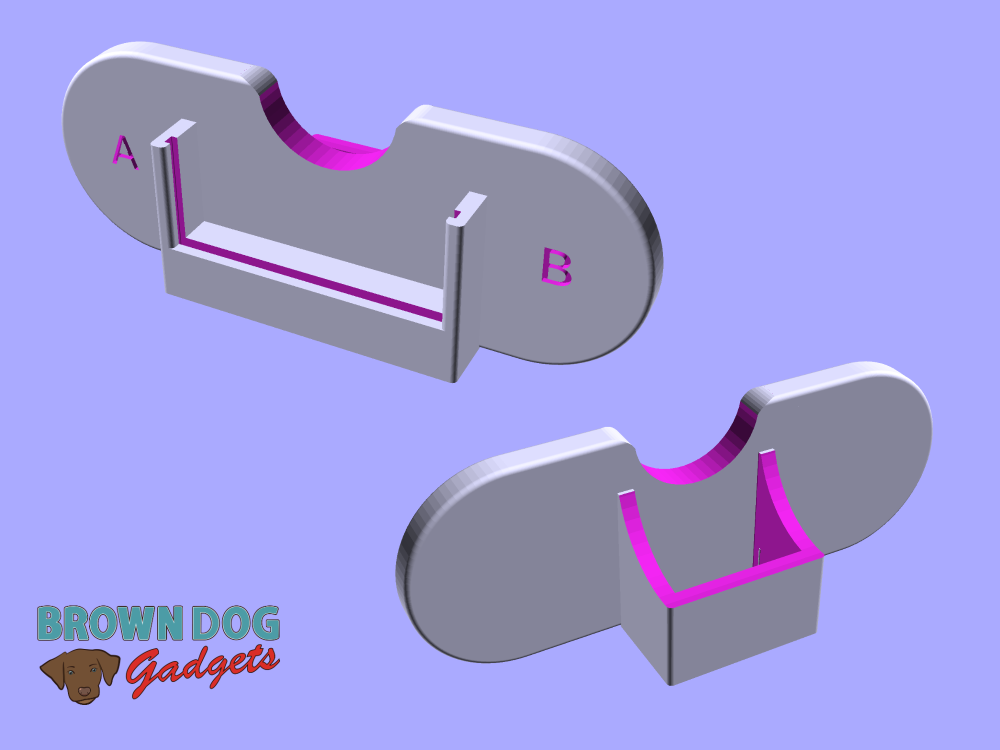
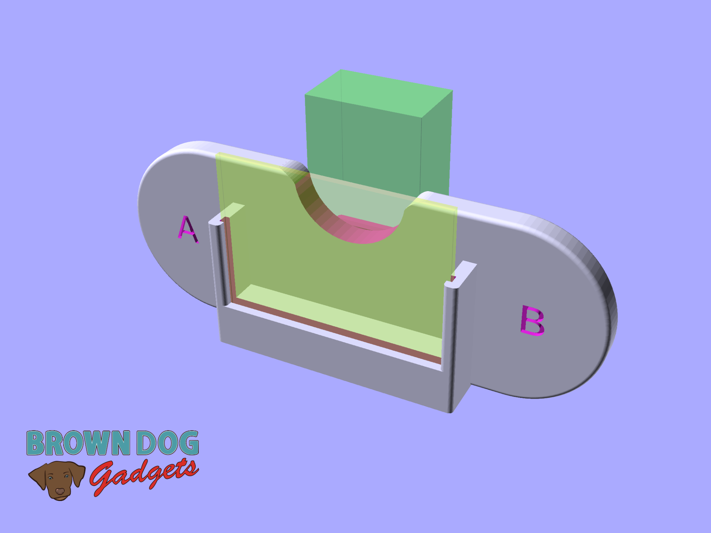
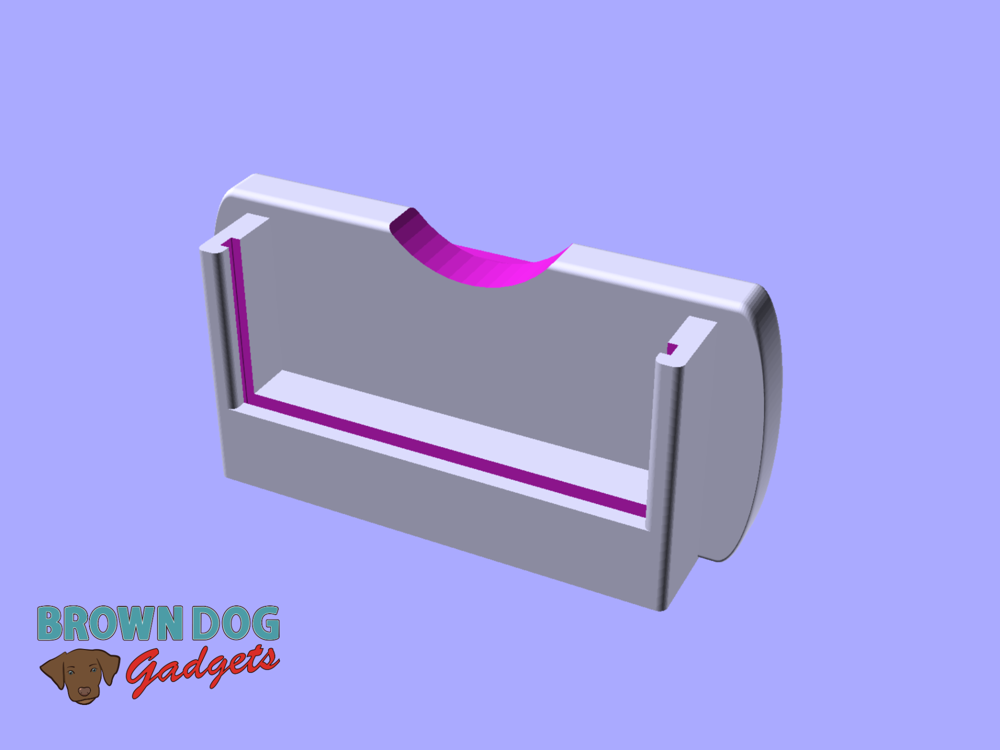

# micro:bit Holder

This is a "game controller" style 3D printed part to hold a micro:bit and the battery pack that comes with it.

There are a few versions.

- MicroBit-Holder.stl is the main version, which has A and B on the handles.
- MicroBit-Holder-No-Text.stl is a version without the A and B text.
- MicroBit-Holder-Small.stl is a minimal version which should print faster.

This file can be printed on a standard FFF (Fused Filament Fabrication) desktop printer without support.

---

Brown Dog Gadgets

https://www.browndoggadgets.com/
