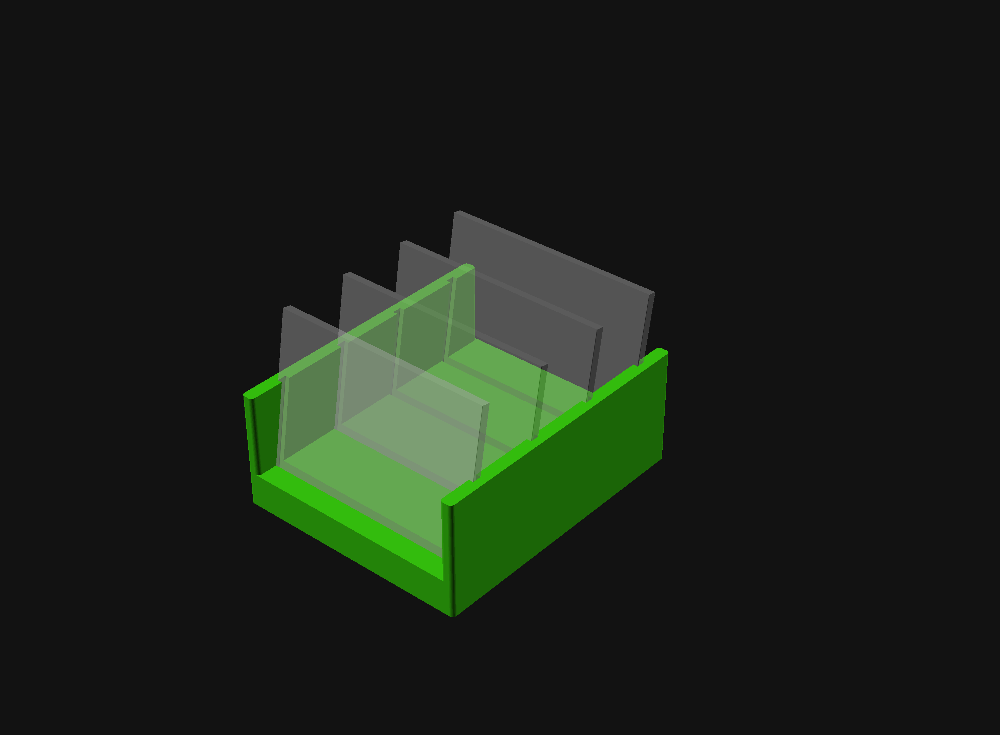
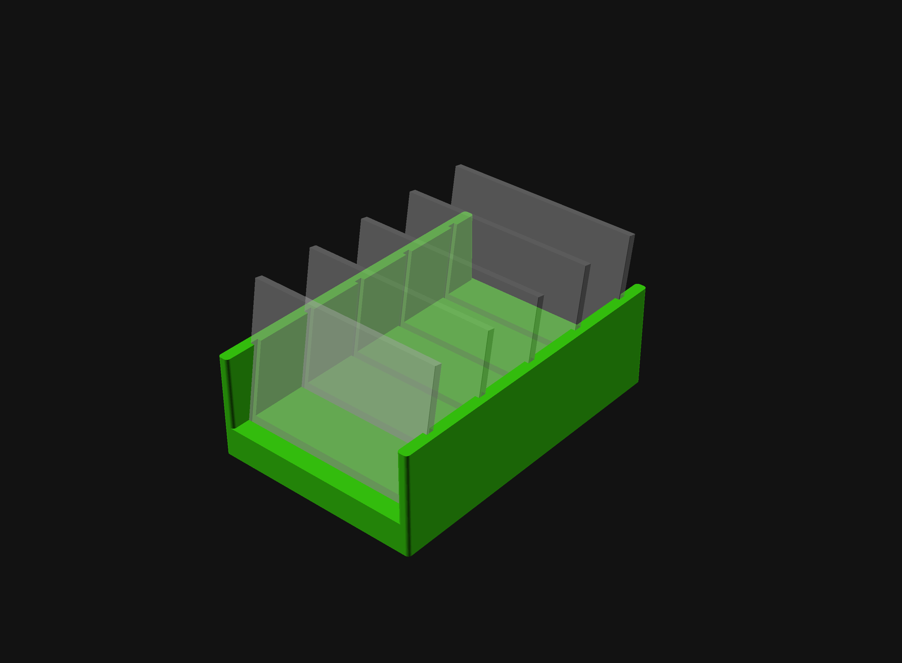
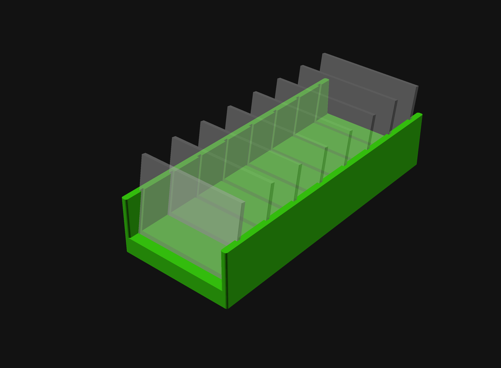
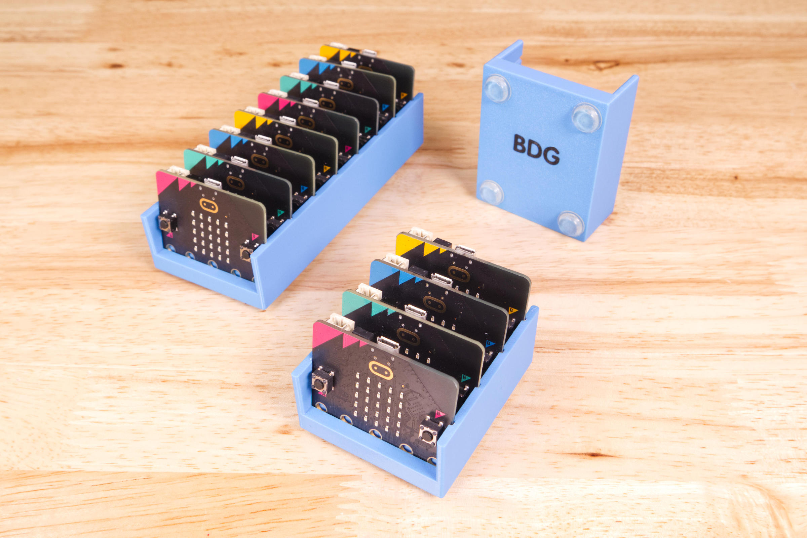
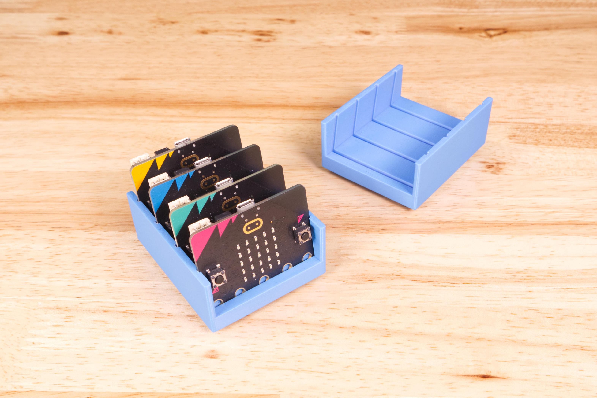
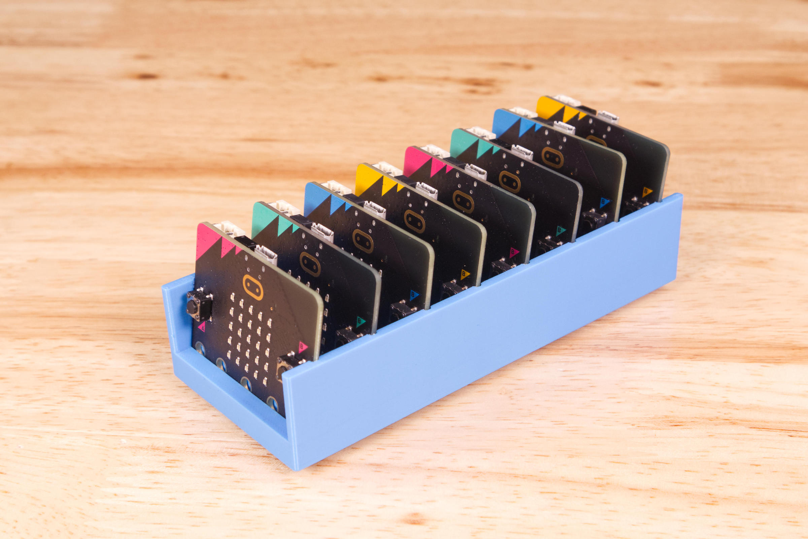
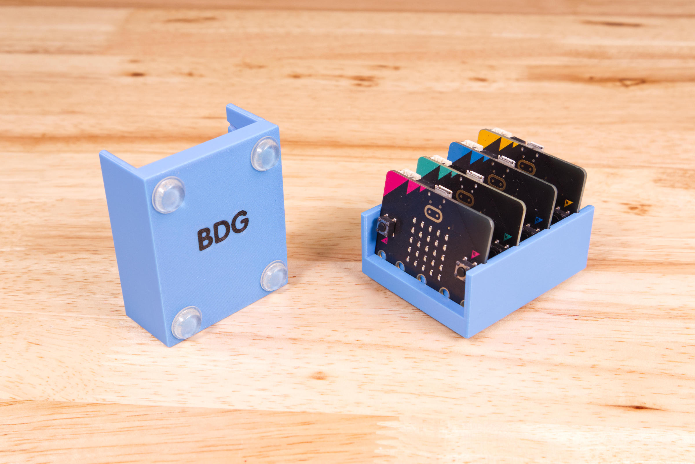
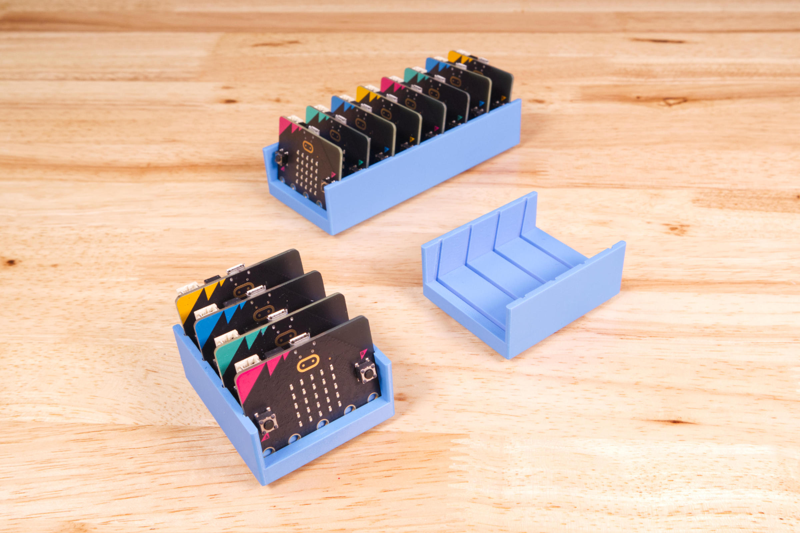
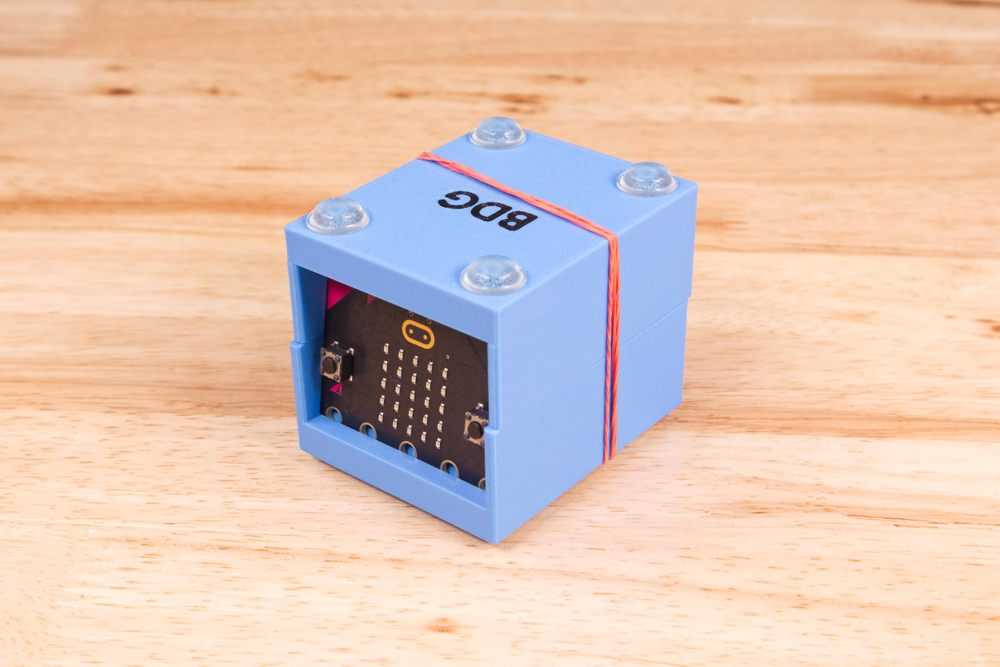

# micro:bit Storage Tray

These are trays for storing your micro:bits.

There are files for 4, 5, and 8 micro:bits, but you can edit the `MicroBit-Storage-Tray.scad` file to create a tray to hold some other quantity. (There are few other parameters you can edit as well, such as angle and spacing.)

The files can be printed in two colors, with a "BDG" on the bottom. (We recommend a darker color for the text.)

You can also just print the tray without the second color for text if desired. You'll get debossed text instead.

We've also included the 3MF files with the two parts/color pre-loaded. Alternately just load the 'body' and 'text' STL files together into your slicer.

These files can be printed on a standard FFF (Fused Filament Fabrication) desktop printer without support.

Check out our other [3D Printed Parts](https://learn.browndoggadgets.com/c/3D_Printed_Parts) as well.

---

Brown Dog Gadgets  
https://www.browndoggadgets.com/
