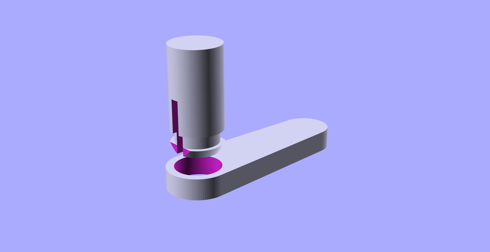
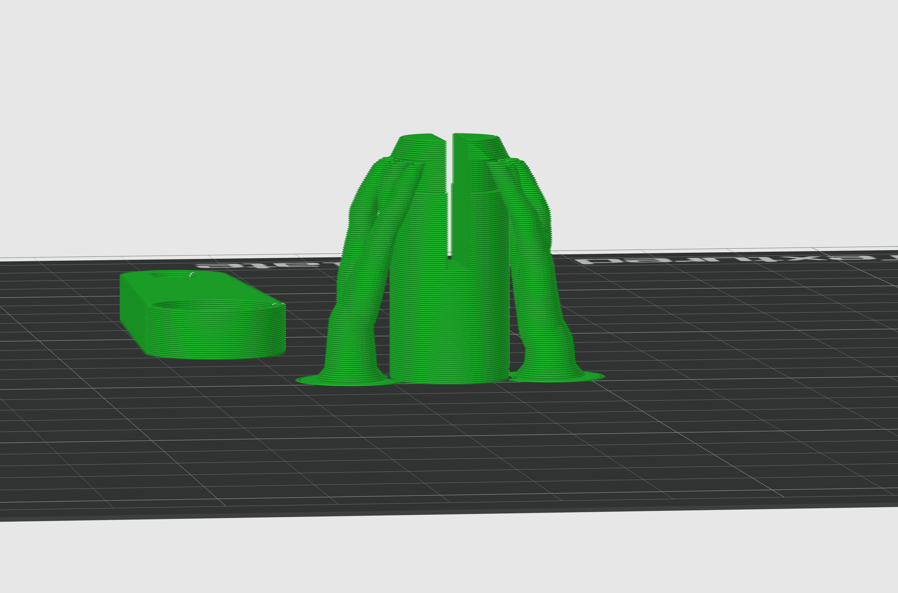
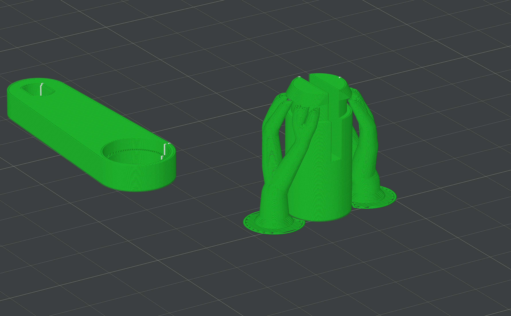
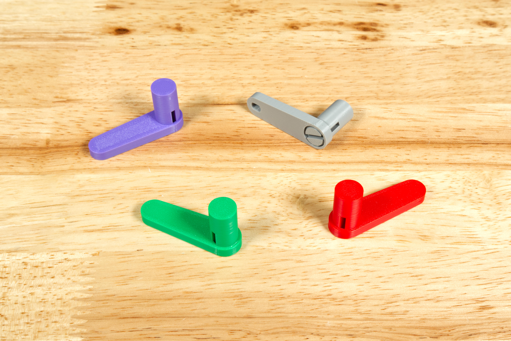
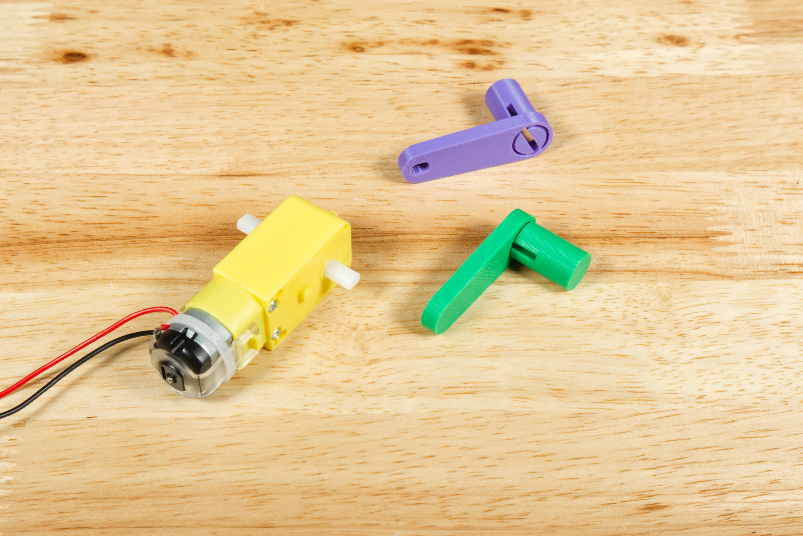
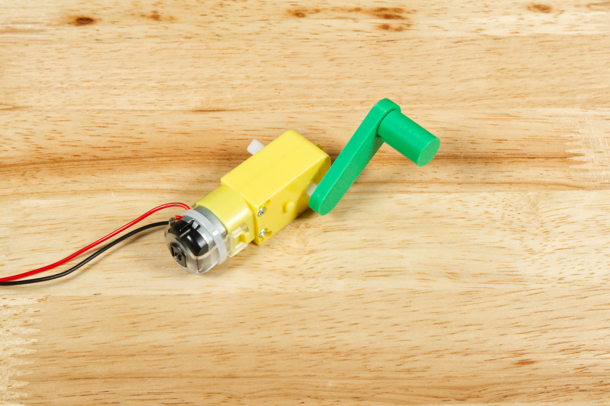

# Motor Crank Handle

The Motor Crank Handle attaches to a motor to allow it to work as a generator.

Print the two parts and then assemble them together.

See the full guide for assembly and use instructions: [Motor Crank Handle](https://learn.browndoggadgets.com/Guide/Motor+Crank+Handle/706)

These files can be printed on a standard FFF (Fused Filament Fabrication) desktop printer but supports should be added for the shaft.

Check out our other [3D Printed Parts](https://learn.browndoggadgets.com/c/3D_Printed_Parts) as well.

---

Brown Dog Gadgets

https://www.browndoggadgets.com/
