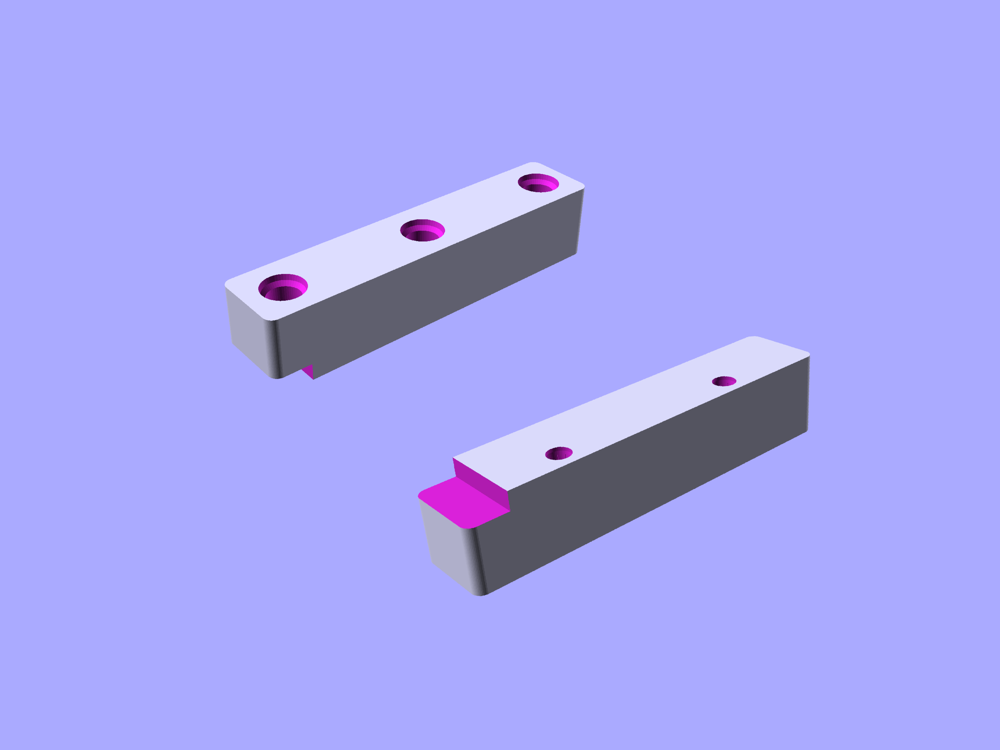
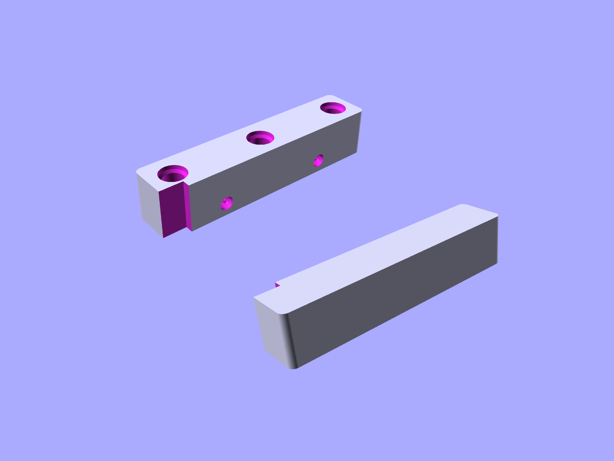
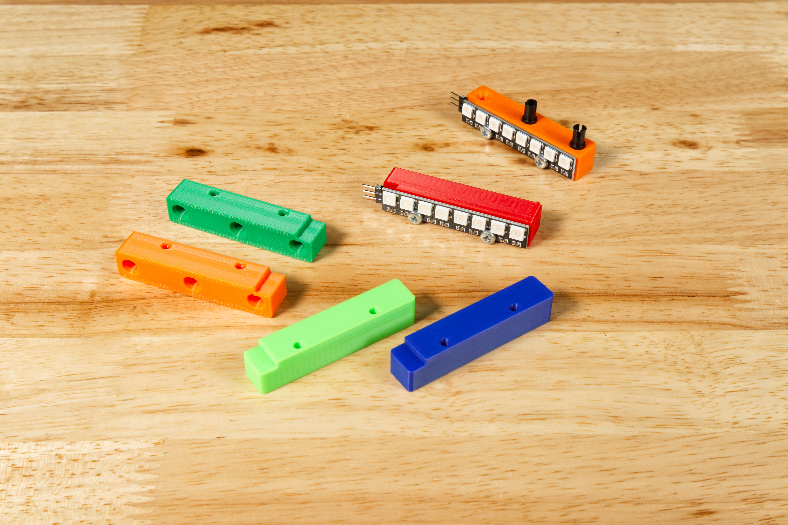
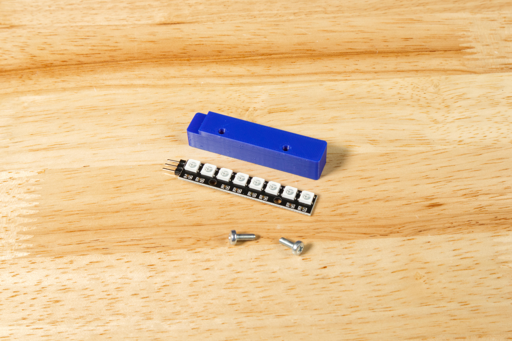
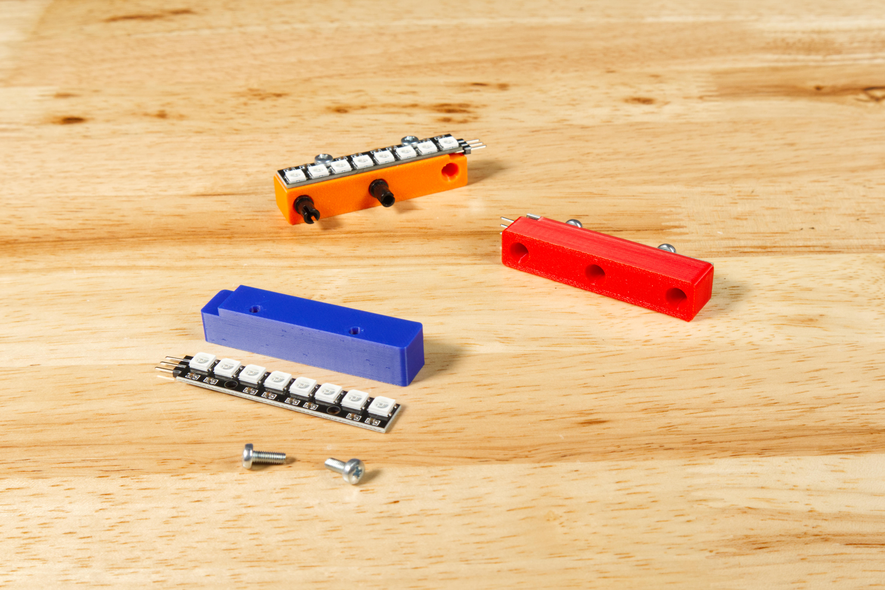

# NeoPixel Beam Holder

The NeoPixel Beam Holder allows you to attach an Addressable RGB LED Strip (commonly referred to as a "NeoPixel Strip") using LEGO Technic Pins.

There are two versions, one that mounts the NeoPixel Strip on the top and one that mounts it on the side.

See the full guide for assembly and use instructions: [NeoPixel Beam Holder](https://learn.browndoggadgets.com/Guide/NeoPixel+Beam+Holder/707)

These files can be printed on a standard FFF (Fused Filament Fabrication) desktop printer without support.

Check out our other [3D Printed Parts](https://learn.browndoggadgets.com/c/3D_Printed_Parts) as well.

### 3mm Hardware

You'll need two 3mm pan head screws. They should be between 6mm long and 10mm long.

- 2 x [Metric machine screws, Phillips pan head, Zinc plated steel, 3mm x 0.5mm x 10mm](https://www.boltdepot.com/Product-Details.aspx?product=17868)

---

Brown Dog Gadgets

https://www.browndoggadgets.com/
