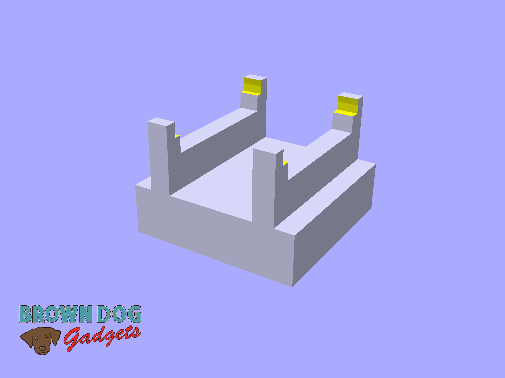
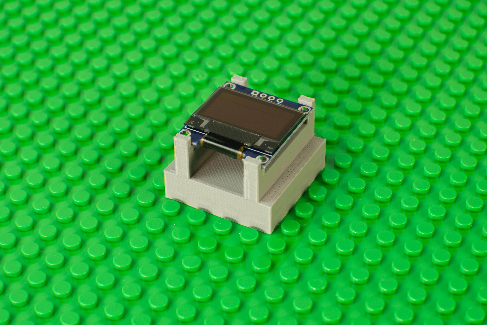

# OLED Display Holder

This is a LEGO compatible file that holds a [OLED Display](https://www.amazon.com/gp/product/B08FD643VZ/) for mounting onto a LEGO baseplate or bricks.

The OLED Display is placed into the holder by putting the bottom half into the bottom holder arms and then gently pressing the top into the top holding arrms.

**Caution:** The OLED display is fragile. Do not press down on the screen. It is recommended to place the 3D printed holder onto the LEGO surface before you insert the display.

**Note:** We've left space beneath the display so that you can solder right angle header pins to the PCB.

This file can be printed on a standard FFF (Fused Filament Fabrication) desktop printer without support.

---

Brown Dog Gadgets

https://www.browndoggadgets.com/
