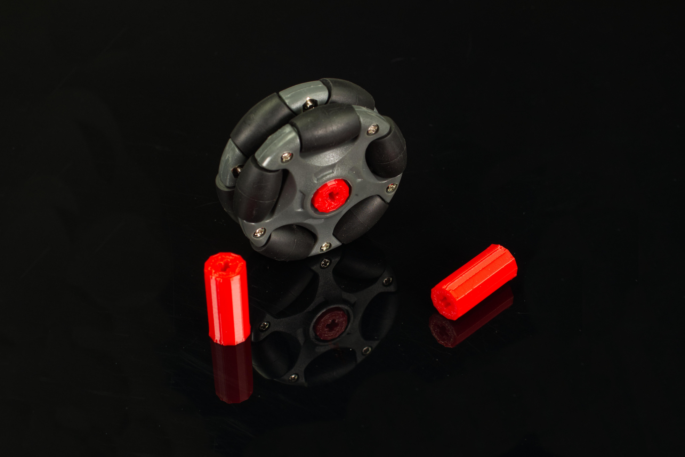

# Omni Wheel Hub

This is a LEGO compatible file that works as an adapter to allow the [Nexus 58mm Plastic Omni Wheel](https://www.robotshop.com/products/58mm-plastic-omni-wheel-compatible-servos-lego-mindstorms-nxt) to attach to a Brick Compatible Servo.

Note that while there is an existing LEGO NXT Hub availble for this wheel, it is meant for long axles to go all the way through, and does not work as a pressure fit for the Brick Compatible Servos we use.

This file can be printed on a standard FFF (Fused Filament Fabrication) desktop printer. You may need support for this one depending on your printer, but you can try a print without support first to see if it works.

---

Brown Dog Gadgets

https://www.browndoggadgets.com/

