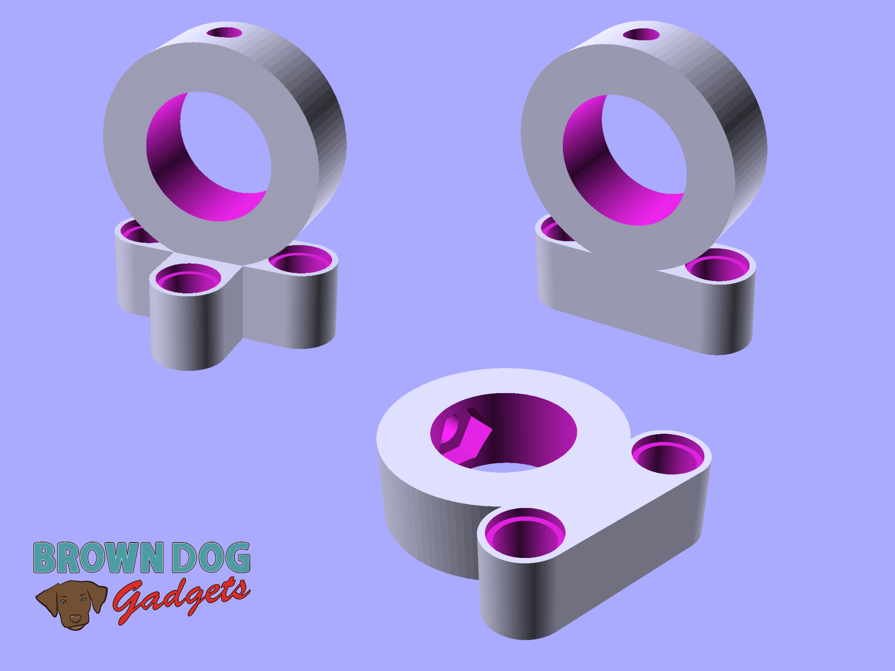
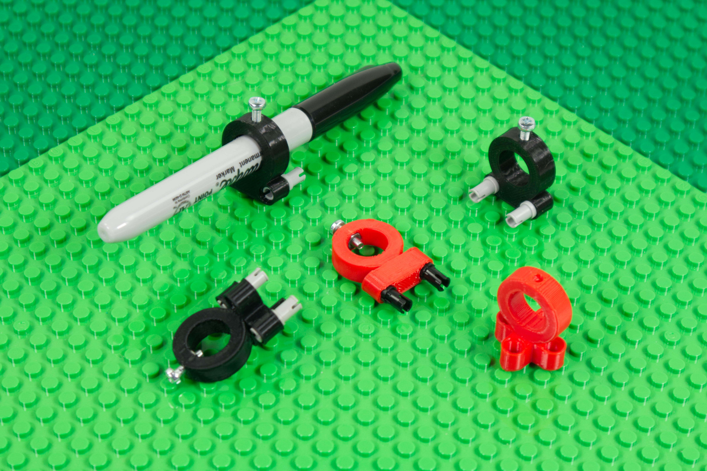
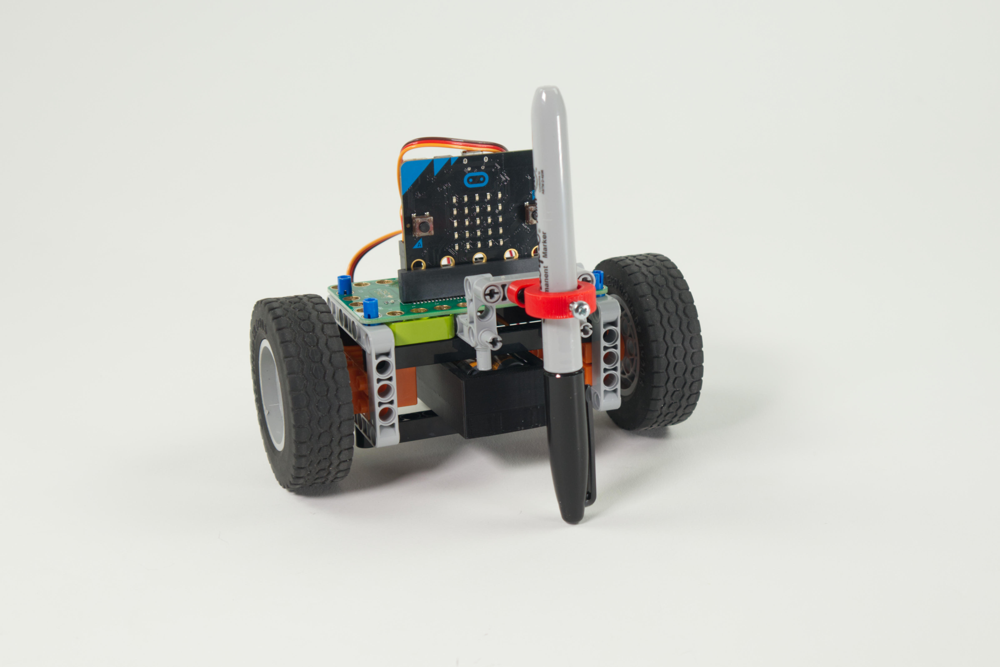
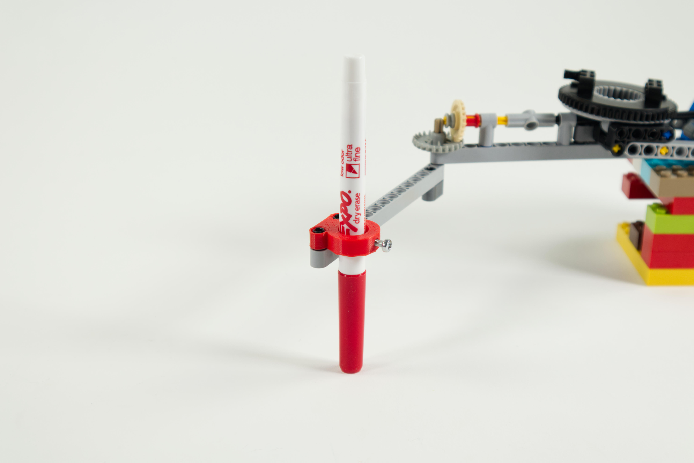

# Pen Holder

This is a LEGO Technic compatible part that holds a pen for mounting onto LEGO Technic parts.

This version works well with a Fine Point Sharpie Marker (or any other pen/marker that is less than 12.5mm in diameter) but other versions suitable for larger markers will be added soon.

We've provided a few variations depending on the angle you wish to mount the pen at. Check all the files and use the one that works best for your situation.

## Compatible with Fine Point Sharpie Marker
- Pen-Holder-FPS-Vertical-Cross.stl
- Pen-Holder-FPS-Vertical.stl
- Pen-Holder-FPS-Horizontal.stl

## Hardware
The Pen Holder requires a 3mm hexnut to be inserted into the cavity on the inside of the circular part. A 3mm bolt (at least 10mm long) then threads through the nut and can be tightened against the pen to hold it in place.

This file can be printed on a standard FFF (Fused Filament Fabrication) desktop printer without support.

---

Brown Dog Gadgets

https://www.browndoggadgets.com/
