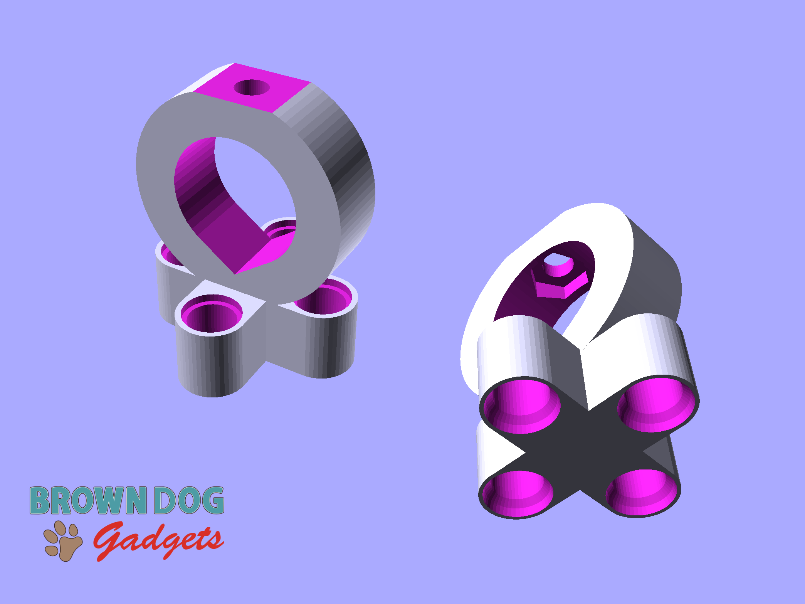
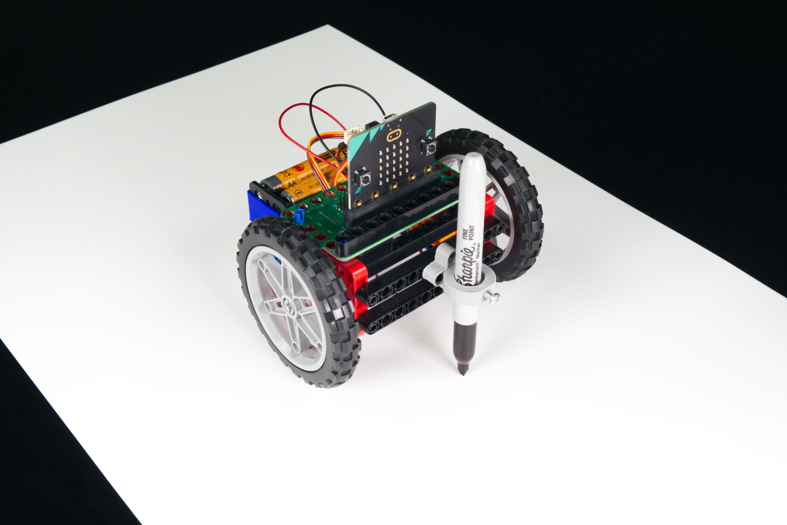

# Pen Holder

This is the Pen Holder for our [Bit Board Rover Kit](https://www.browndoggadgets.com/products/bit-board-rover). It is a Technic compatible component that can hold a mark making device.

This version works well with a Fine Point Sharpie Marker or any other pen/marker that is less than 13mm in diameter.

## Hardware
The Pen Holder requires a 3mm hex nut to be inserted into the cavity on the inside of the circular part. A 3mm bolt (at least 10mm long) then threads through the nut and can be tightened against the pen to hold it in place. (Do not over-tighten the screw. It just needs to be tight enough to hold the pen in place.)

This file can be printed on a standard FFF (Fused Filament Fabrication) desktop printer without support.

---

Brown Dog Gadgets

https://www.browndoggadgets.com/
