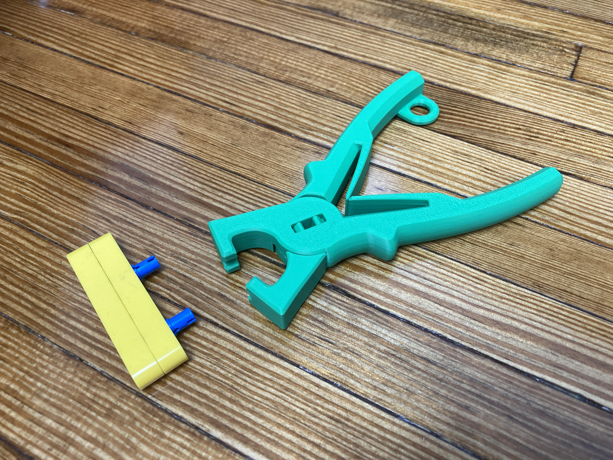
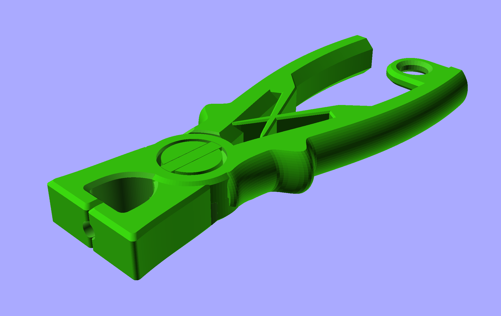

# Pin Pliers

The Pin Pliers can be used to pull out a difficult to remove LEGO Technic Pin.

It prints in three parts and then the small clip holds the two halves of the pliers together.

We modified Anachronist's [Over-engineered JST connector pliers](https://www.printables.com/model/459462-over-engineered-jst-connector-pliers) by changing the front part to be compatible with the LEGO Technic Pin.

These files can be printed on a standard FFF (Fused Filament Fabrication) desktop printer without support.

Check out our other [3D Printed Parts](https://learn.browndoggadgets.com/c/3D_Printed_Parts) as well.

---

Brown Dog Gadgets

https://www.browndoggadgets.com/
