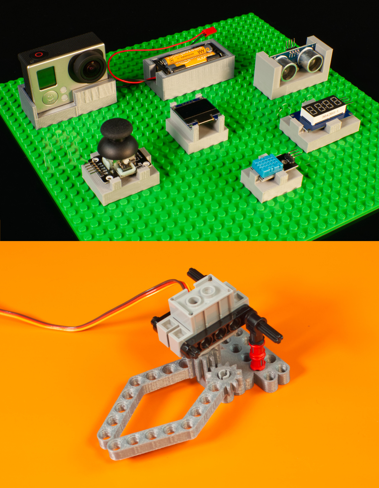

# 3D Printed Parts

These are custom 3D printed parts that make it easy to hold a variety of electronic components we use at [Brown Dog Gadgets](https://www.browndoggadgets.com/).

They are LEGO compatible, and are meant to be attached to a LEGO baseplates, bricks, or Technic Beams.

Some of the parts are LEGO compatible and are designed to make building things easier or extending beyond what LEGO parts alone can do.

The files can be printed on a standard FFF (Fused Filament Fabrication) desktop printer without support.

---

Brown Dog Gadgets

https://www.browndoggadgets.com/
