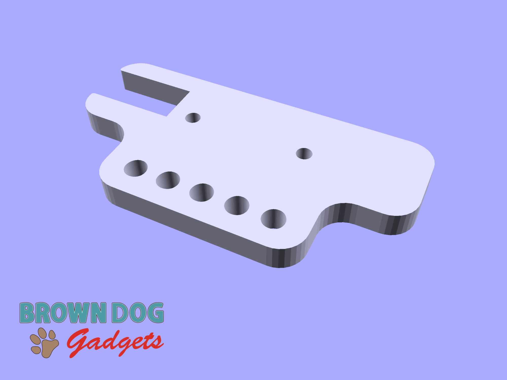
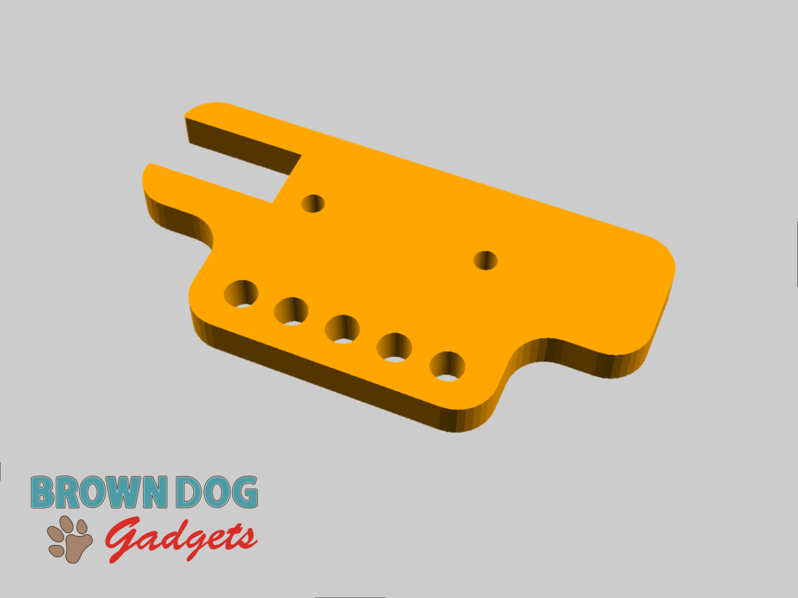

# Rover NeoPixel Holder

If you want to build your own Rover NeoPixel Holder you can 3D print the STL file, or use the SVG file to laser cut a single piece of 6mm acrylic or two pieces of 3mm acrylic.

This file can be printed on a standard FFF (Fused Filament Fabrication) desktop printer without support.

The piece in the SVG file should be 81.225mm wide and 40mm tall. If it gets resized by your software proportionally scale to match that width.

Check out the guide for usage: https://learn.browndoggadgets.com/Guide/Addressable+RGB+LED+Strip/539

## Assembly Hardware

You will need 2 screws as well as 2 matching hex nuts to secure the NeoPixel strip to the NeoPixel Holder.

You will also need 2 LEGO Technic Pins to mount the NeoPixel Holder onto the Rover.

### 3mm Hardware

- 2 x [Metric machine screws, Phillips pan head, Zinc plated steel, 3mm x 0.5mm x 10mm](https://www.boltdepot.com/Product-Details.aspx?product=17868)
- 2 x [Metric hex nuts, Zinc plated class 8.8 steel, 3mm x 0.5mm](https://www.boltdepot.com/Product-Details.aspx?product=4783)

### LEGO Technic Pins

- 2 x [LEGO Technic Pin with Friction Ridges and Slots (2780 / 61332)](https://www.brickowl.com/catalog/lego-technic-pin-with-friction-ridges-and-slots-2780-61332)

---

Brown Dog Gadgets

https://www.browndoggadgets.com/
