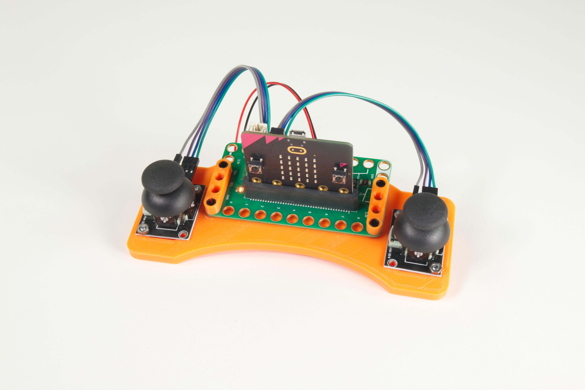
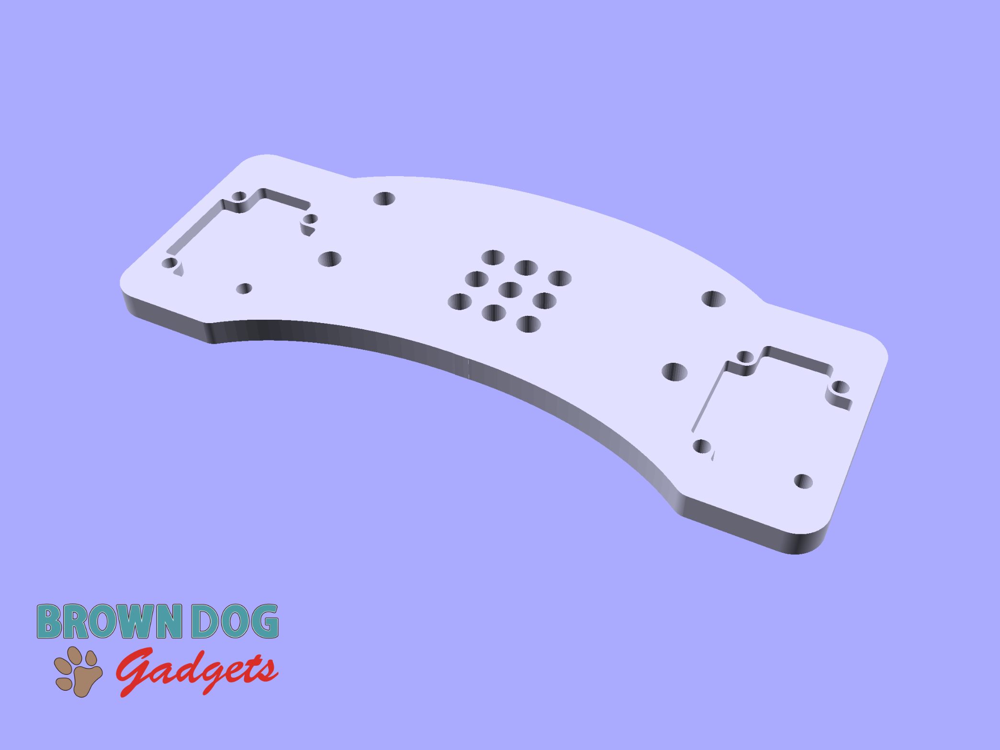

# Rover Remote

If you want to build your own Rover Remote you can 3D print the STL file, or use the SVG file to laser cut two pieces of 3mm acrylic.

This file can be printed on a standard FFF (Fused Filament Fabrication) desktop printer without support.

The Remote pieces in the SVG file should be 155.43mm wide. If they get resized by your software proportionally scale to match that width.

We've included one more file (`Beam-4-Hole.stl`) which you can print two of if you want to use them to secure the Bit Board onto the Remote.

## Assembly Hardware

You will need 4 screws as well as 4 matching hex nuts to secure the Thumbsticks to the Remote. (The screws also hold the two pieces of laser cut acrylic together.)

You will also need 4 LEGO Technic Pins to mount the Bit Board to the Remote.

### 3mm Hardware

- 4 x [Metric machine screws, Phillips pan head, Zinc plated steel, 3mm x 0.5mm x 10mm](https://www.boltdepot.com/Product-Details.aspx?product=17868)
- 4 x [Metric hex nuts, Zinc plated class 8.8 steel, 3mm x 0.5mm](https://www.boltdepot.com/Product-Details.aspx?product=4783)

### LEGO Technic Pins

- 4 x [LEGO Technic Pin with Friction Ridges and Slots (2780 / 61332)](https://www.brickowl.com/catalog/lego-technic-pin-with-friction-ridges-and-slots-2780-61332)

---

Brown Dog Gadgets

https://www.browndoggadgets.com/
