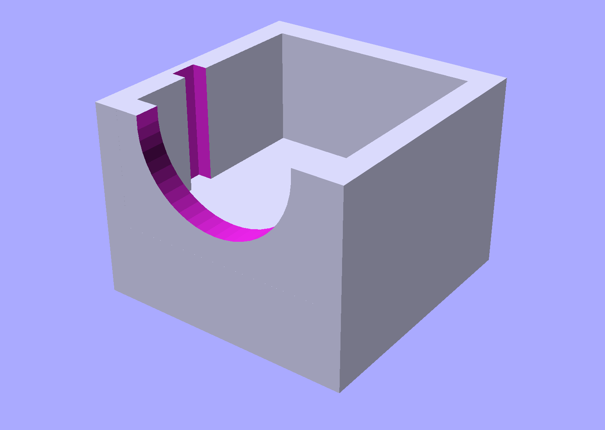
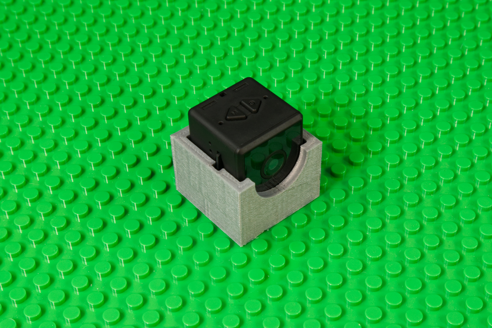
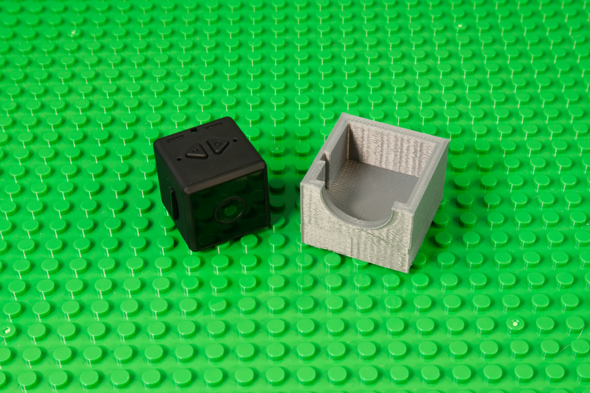

# Spy Camera Holder

This is a LEGO compatible file that holds an [Spy Camera](https://www.amazon.com/gp/product/B0838TTKBQ/) for mounting onto a LEGO baseplate or bricks.

The Spy Camera sits inside the holder loosely. If you want a more secure fit you can add some tape to hold the camera into place.

This file can be printed on a standard FFF (Fused Filament Fabrication) desktop printer without support.

---

Brown Dog Gadgets

https://www.browndoggadgets.com/
