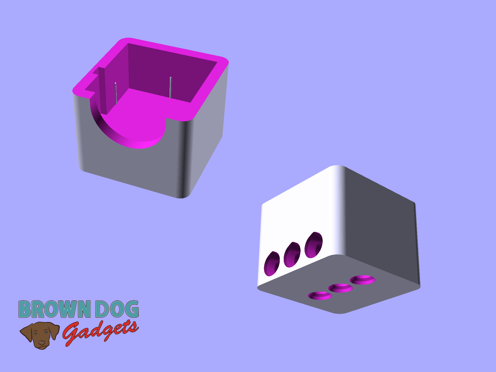
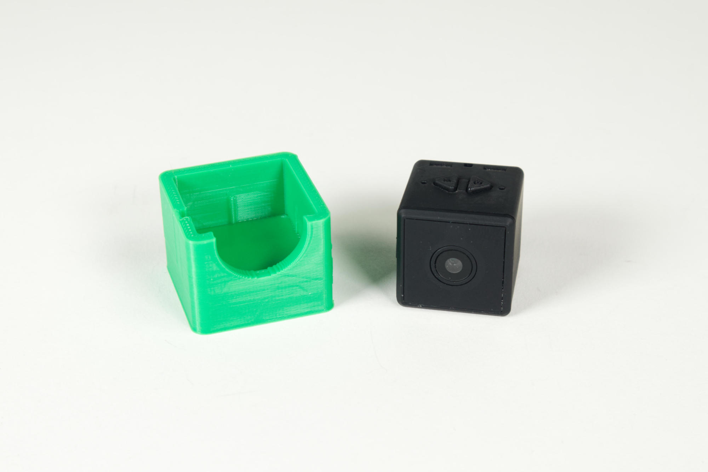
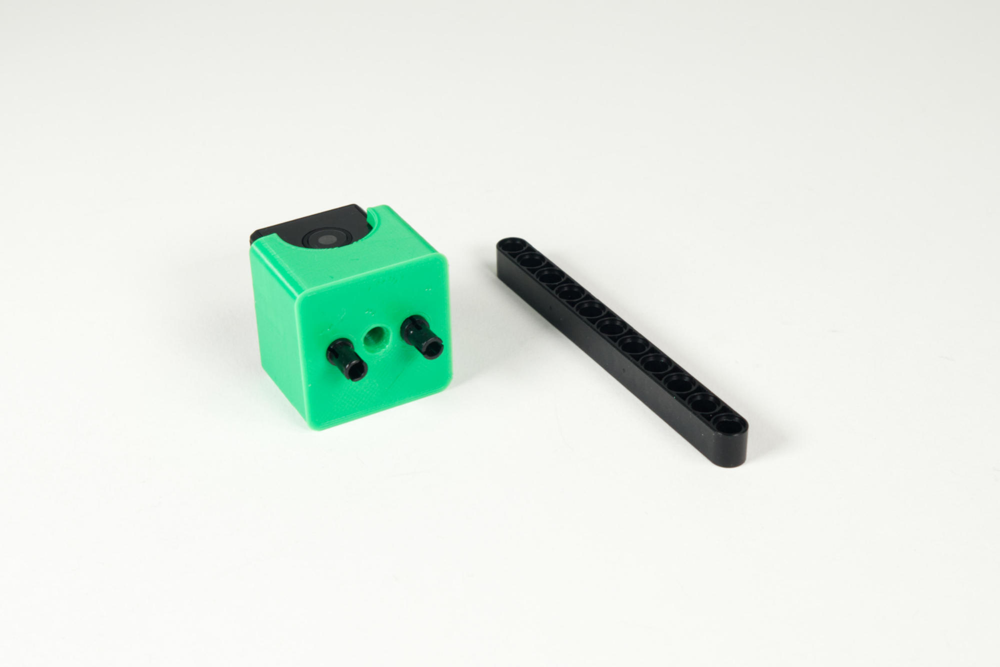
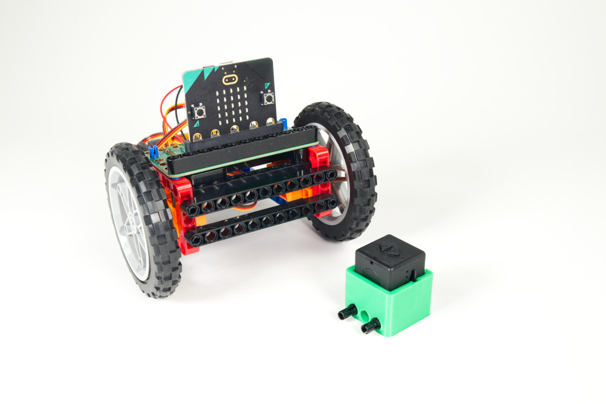
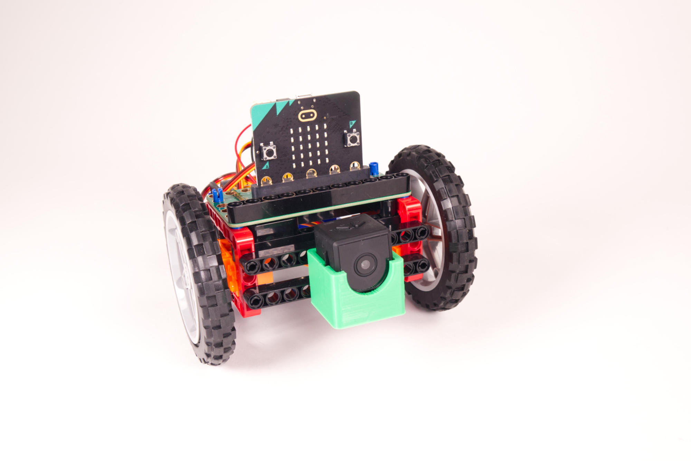

# Spy Camera Holder

This is a LEGO Technic compatible file that holds a [Spy Camera](https://www.amazon.com/gp/product/B0838TTKBQ/) for mounting onto LEGO Technic parts.

If the camera sits a bit loose in the holder you can add some tape to help shim it into place. If the camera doesn't fit try printing the holder at 102% size.

This file can be printed on a standard FFF (Fused Filament Fabrication) desktop printer without support.

---

Brown Dog Gadgets

https://www.browndoggadgets.com/
