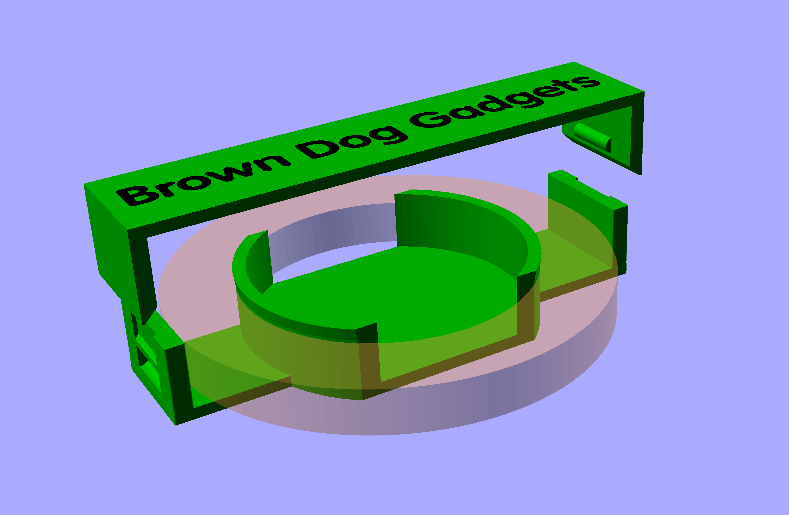
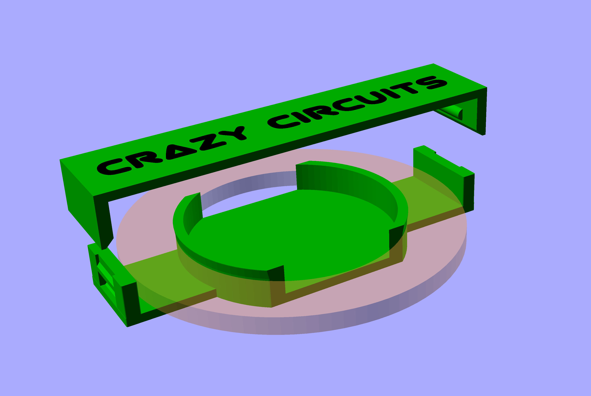

# Tape Roll Holder

Files for a 3D printed tape roll holder that can be used with [Maker Tape](https://www.browndoggadgets.com/products/maker-tape-1-4th-inch-20m-roll-nylon-conductive-tape) from Brown Dog Gadgets.

These files can be printed on a standard FFF (Fused Filament Fabrication) desktop printer without support.

We've separated the **1/4" wide tape** holders and the **1/8" wide tape** holders into separate directories.

(We recommend 1/4" for Paper Circuits and 1/8" for Crazy Circuits.)

---

Brown Dog Gadgets  
[www.browndoggadgets.com](https://www.browndoggadgets.com/)
