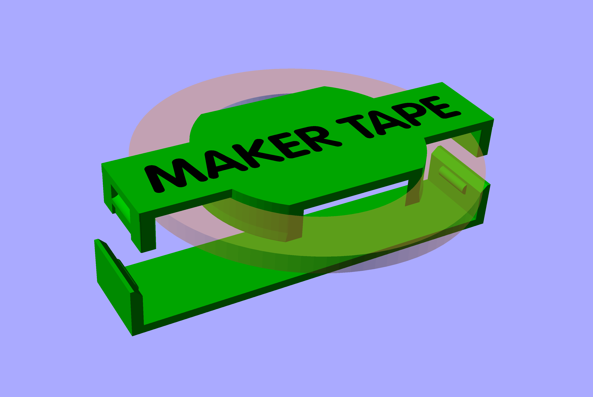
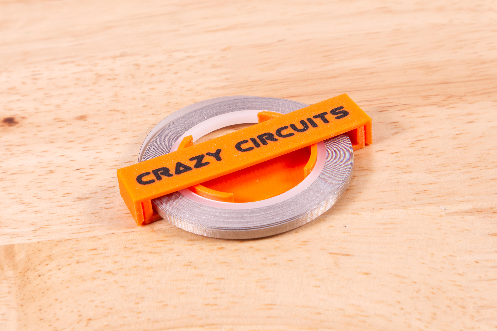
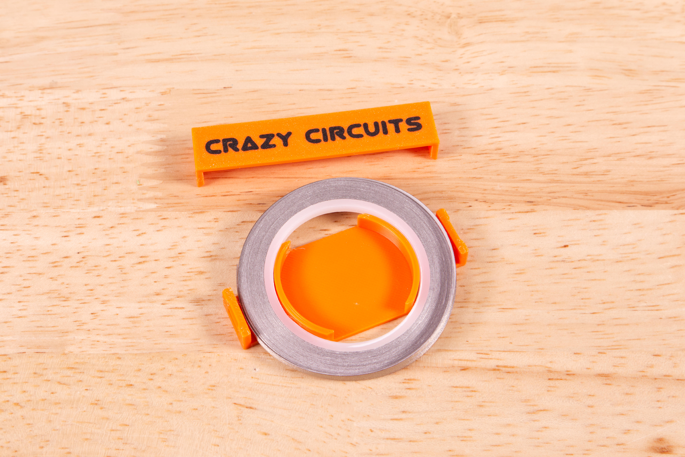
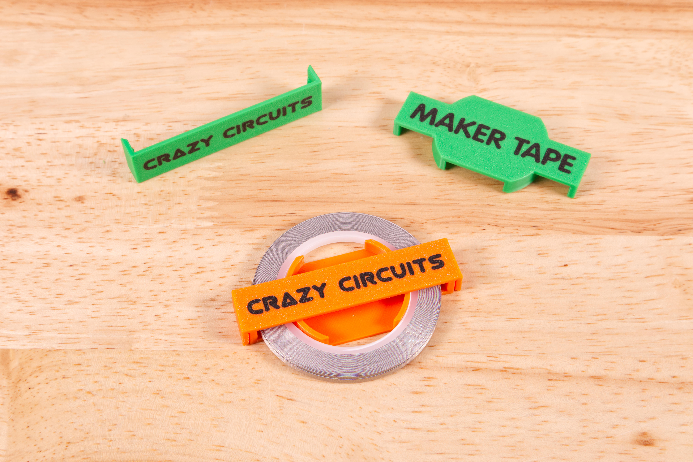
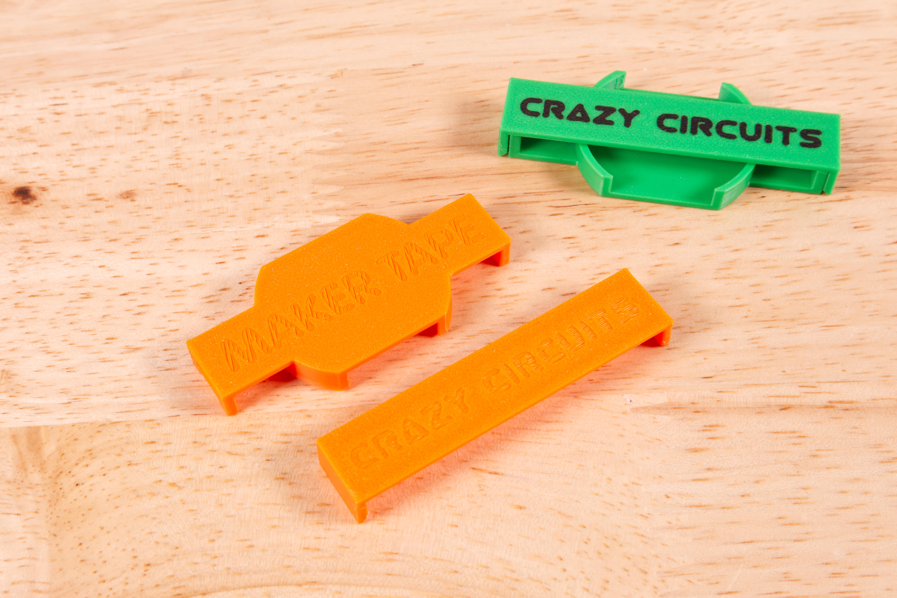
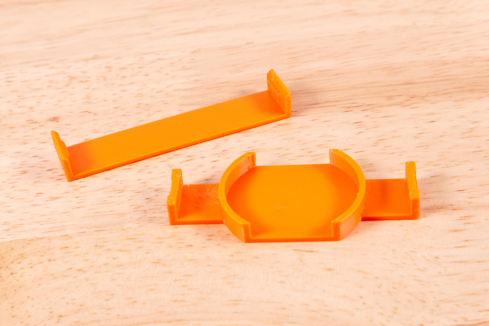

# Tape Roll Holder (1/8" Wide)

Tape Roll Holders for a 5 Meter Roll of 1/8" Maker Tape.

---

## 5 Meter Roll

Files for a 3D printed tape roll holder that can be used with 1/8" Wide, 5 Meter Roll of Maker Tape from Brown Dog Gadgets.

These files can be printed on a standard FFF (Fused Filament Fabrication) desktop printer without support.

The latest version of our Small Tape Roll Holder (v3) has been simplified. It now consists of the main body and a single clip. There is less chance of the tape getting tangled or twisted now.

We've also included text on the body and the clip. If you have a multi-color 3D printer we recommend printing the text in black, or at least a darker color than the rest of the print. (You can also ignore the text and just print the body and clip as single-color prints.)

---

Brown Dog Gadgets  
[www.browndoggadgets.com](https://www.browndoggadgets.com/)
