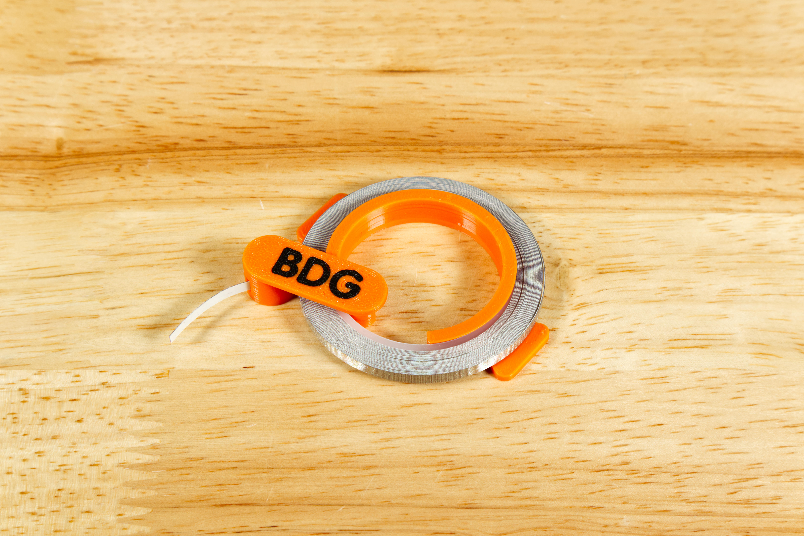

# Tape Roll Holder (1/8" Wide)

Tape Roll Holders for a 5 Meter Roll of 1/8" Maker Tape.

---

## 5 Meter Roll

Files for a 3D printed tape roll holder that can be used with 1/8" Wide, 5 Meter Roll of Maker Tape from Brown Dog Gadgets.

These files can be printed on a standard FFF (Fused Filament Fabrication) desktop printer without support.

We've also included the letters "BDG" which you can add to the lock if you want to do a two-color print. (If not, just print the lock by itself.)

---

Brown Dog Gadgets

https://www.browndoggadgets.com/
