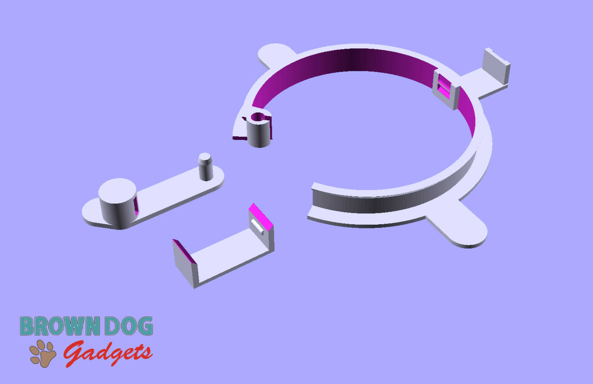
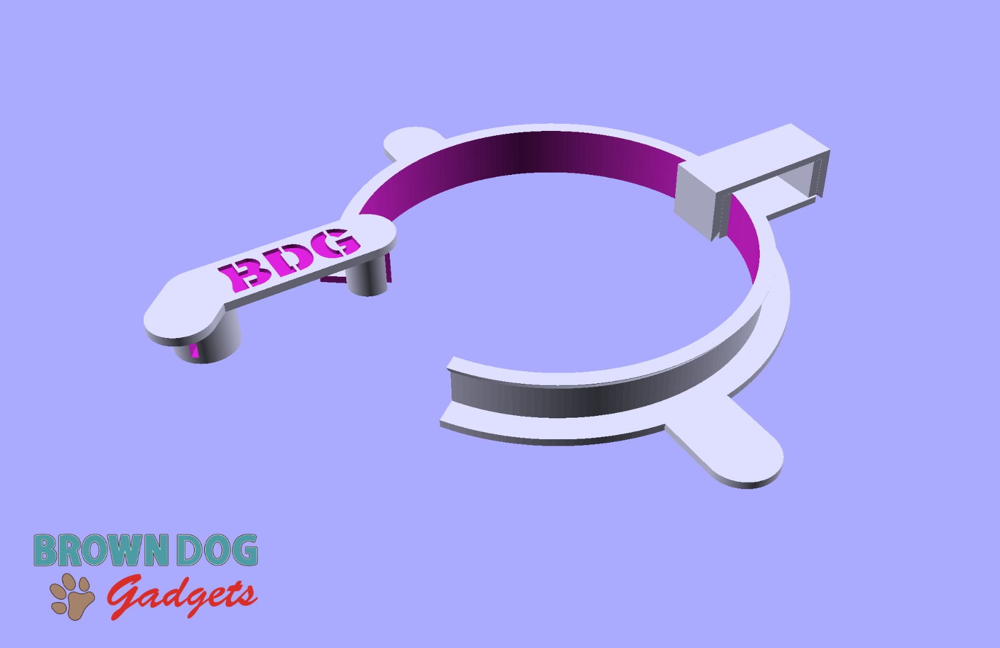
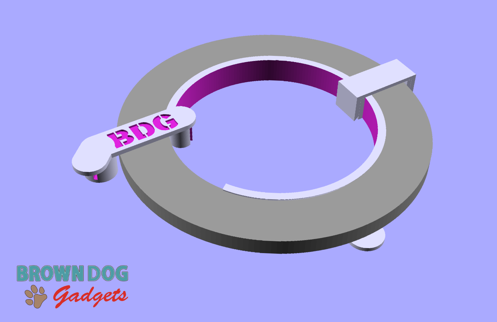
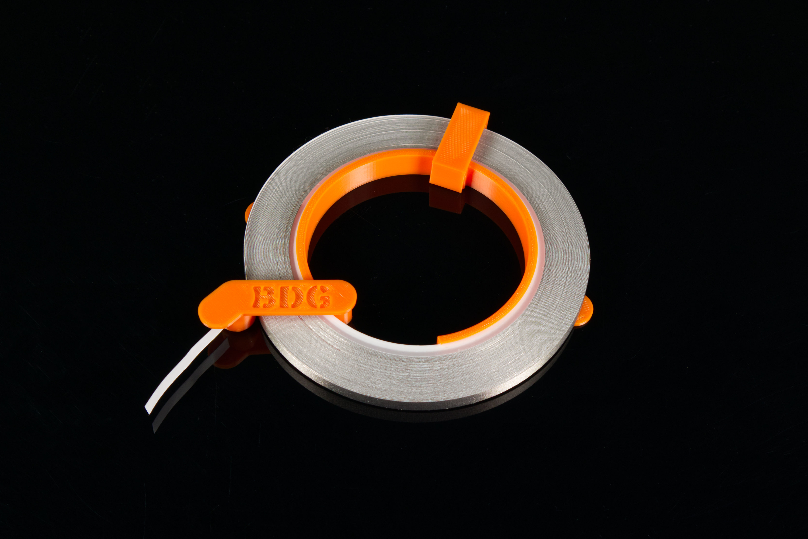
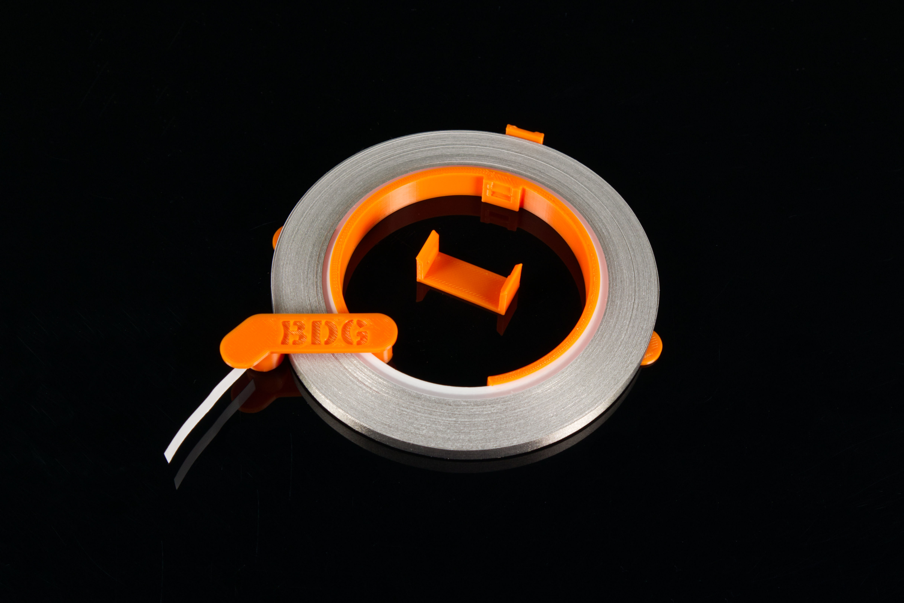
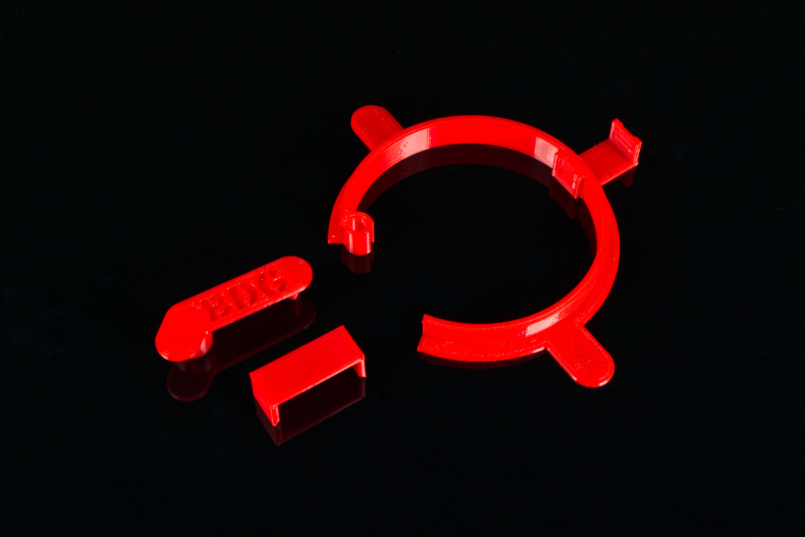
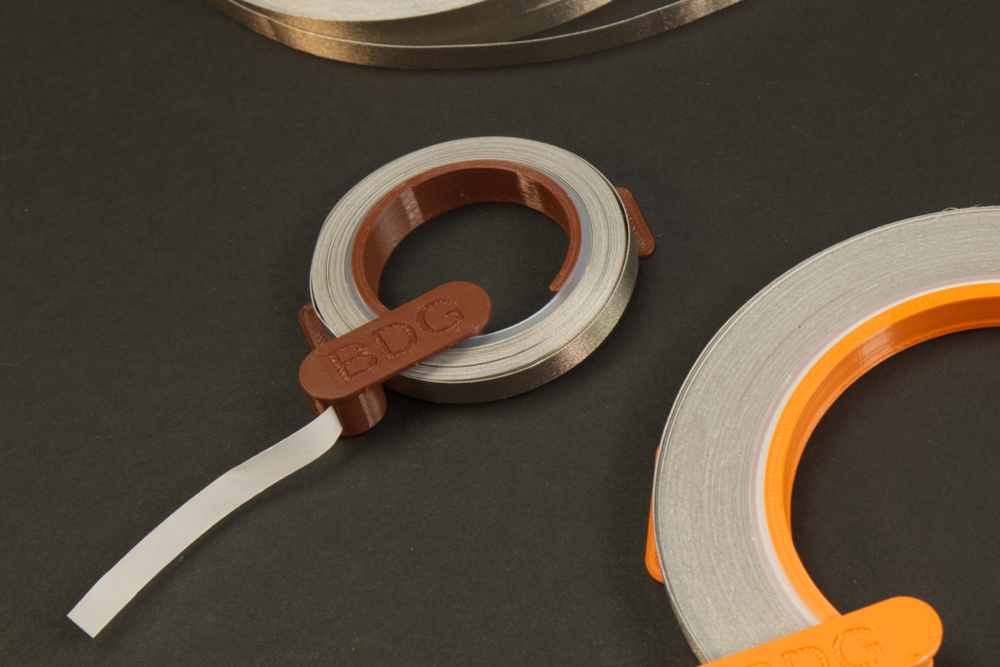

# Tape Roll Holder - 1/4" Maker Tape

Files for a 3D printed tape roll holder that can be used with 1/4" wide Maker Tape from Brown Dog Gadgets.

These files can be printed on a standard FFF (Fused Filament Fabrication) desktop printer without support.

## 2023-04-13 New Version!

The latest version of our Large Tape Roll Holder features an extended Lock to help prevent cutting the tape too close to the feeding slot. (We've also widened the entrance side of the slot to make it easier to feed the tape through.)

We've also changed the swing-in-place lock to be a Clip. Once you put a roll of tape onto the holder you can add the Clip to help prevent the tape from unspooling from the roll. The Clip is removable if you need to replace the roll of tape when it runs out.

These changes are the result of working with educators at events for the past year. We hope you find the improvements useful! (We've left the old v2 files in this repository in case you still need them.)

We've left the Small Tape Roll Holder as-is, with no new modifications.

---

Brown Dog Gadgets

https://www.browndoggadgets.com/
