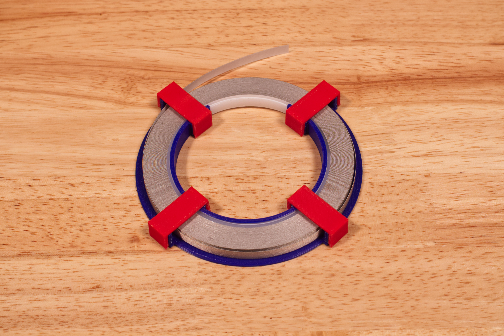

# Tape Roll Holder - 1/4" Maker Tape

Files for a 3D printed tape roll holder that can be used with 1/4" wide Maker Tape from Brown Dog Gadgets.

These files can be printed on a standard FFF (Fused Filament Fabrication) desktop printer without support.

## 2023-10-12 New Version!

The latest version of our Large Tape Roll Holder (v4) has been simplified. It now consists of the main body and 4 clips. There is much less chance of the tape getting tangled or twisted now.

These changes are the result of working with educators at events for the past year. We hope you find the improvements useful! (We've left the older files in this repository in case you still need them.)

---

Brown Dog Gadgets

https://www.browndoggadgets.com/
