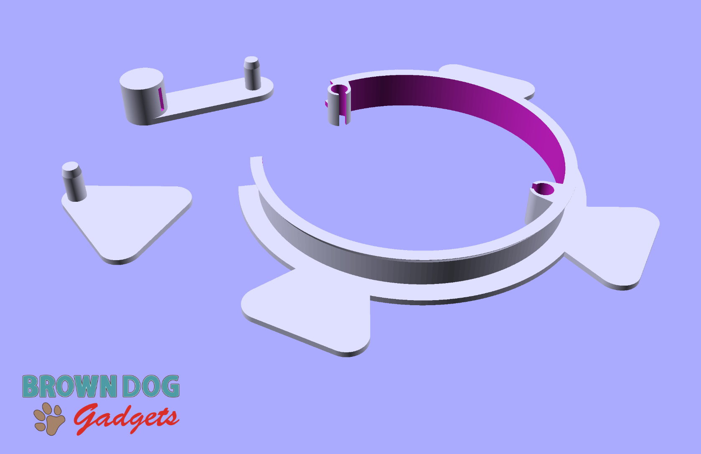
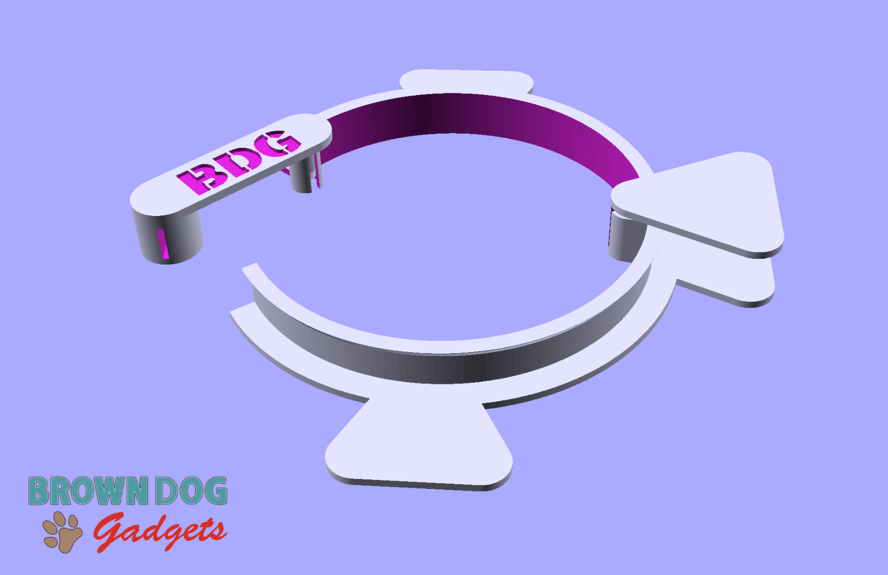

# Tape Roll Holder - 1/4" Maker Tape

Files for a 3D printed tape roll holder that can be used with 1/4" wide Maker Tape from Brown Dog Gadgets.

These files can be printed on a standard FFF (Fused Filament Fabrication) desktop printer without support.

**2021-09-02 New Version!**

We've updated the Large version to add an addtional "foot" to help hold the tape in place. The foot is optional but you may find it useful.

---

Brown Dog Gadgets

https://www.browndoggadgets.com/
