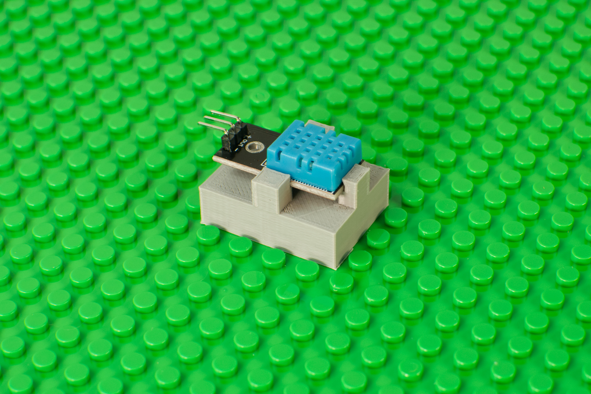

# Temperature and Humidity Sensor Holder

This is a LEGO compatible file that holds a [Temperature and Humidity Sensor](https://www.browndoggadgets.com/products/temperature-and-humidity-sensor) for mounting onto a LEGO baseplate or bricks.

The Temperature and Humidity Sensor slides into the holder and is held in place by friction. If the fit is a bit too tight you can file or sand the inside holding arms of the print.

This file can be printed on a standard FFF (Fused Filament Fabrication) desktop printer without support.

---

Brown Dog Gadgets

https://www.browndoggadgets.com/
