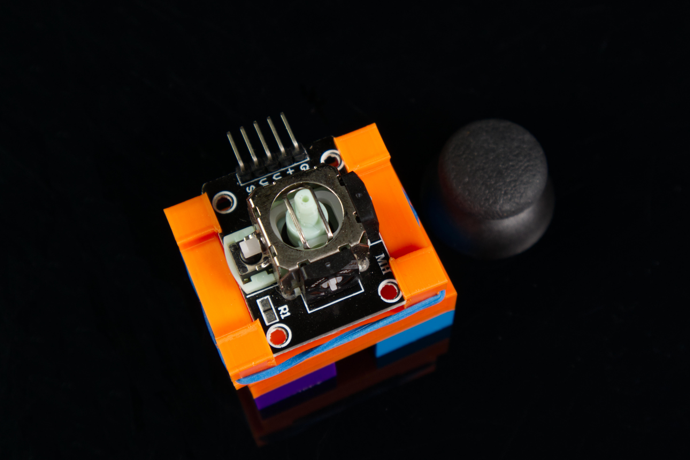

# Thumbstick Sensor Holder

Files for our Component Holder sized to hold a [Thumbstick Sensor](https://www.browndoggadgets.com/products/thumb-stick-sensor) for mounting onto a LEGO baseplate or bricks.

For tips on using this check out our [3D Printed Component Holder](https://learn.browndoggadgets.com/Guide/3D+Printed+Component+Holder/578) guide.

These files can be printed on a standard FFF (Fused Filament Fabrication) desktop printer without support.

---

Brown Dog Gadgets

https://www.browndoggadgets.com/
