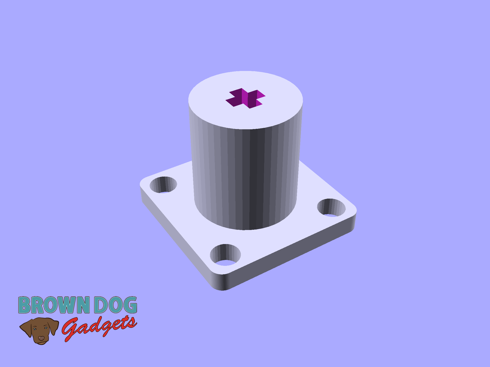
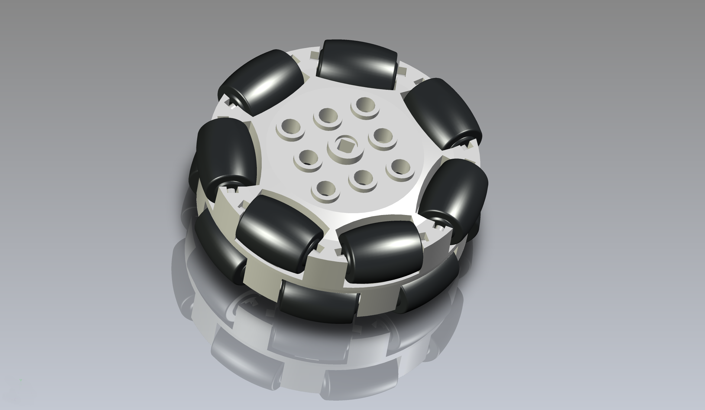

# VEX 228-2536 Omni Wheel Adapter

This is a LEGO compatible file that works as an adapter to allow for the [VEX 200mm Travel Omni-Directional Wheel](https://www.vexrobotics.com/228-2536.html) to work with LEGO Technic Axles.

There is a 3mm version and a 4mm version. The 4mm version will fit snug, and the 3mm version will have a bit more play.

This file can be printed on a standard FFF (Fused Filament Fabrication) desktop printer without support.

---

Brown Dog Gadgets

https://www.browndoggadgets.com/
