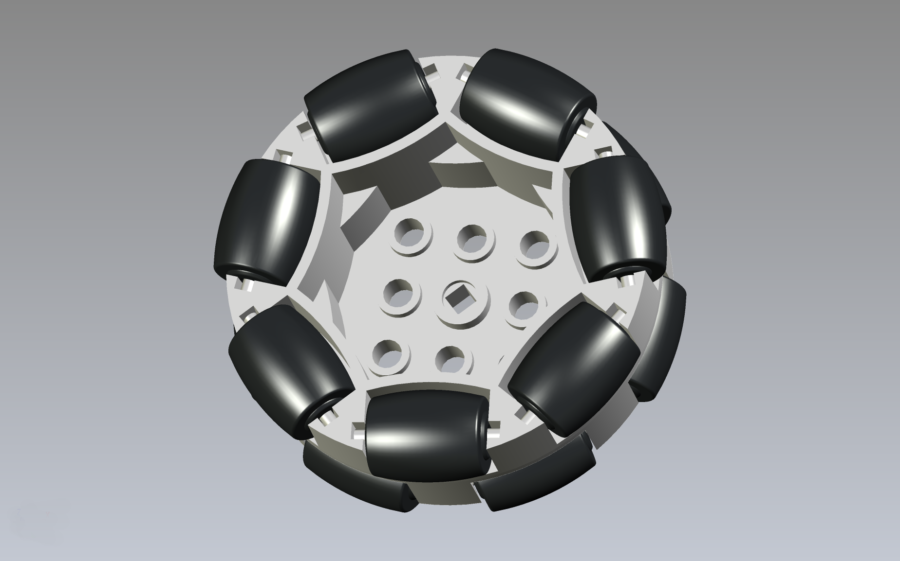

# VEX 228-2536 Omni Wheel Adapter

This is a LEGO compatible file that works as an adapter to allow for the [VEX 200mm Travel Omni-Directional Wheel](https://www.vexrobotics.com/228-2536.html) to work with LEGO Technic Axles.

There is a 3mm version and a 4mm version. The 4mm version will fit snug, and the 3mm version will have a bit more play.

This file can be printed on a standard FFF (Fused Filament Fabrication) desktop printer. You may need support for this one depending on your printer, but you can try a print without support first to see if it works.

## Assembly Hardware

You will need 4 bolts (12mm in length) as well as 4 matching hex nuts. You should choose either 4mm bolts or 3mm bolts depending on which adapters you print.

### 4mm Hardware

- 4 x [Metric machine screws, Phillips pan head, Zinc plated steel, 4mm x 0.7mm x 12mm](https://www.boltdepot.com/Product-Details.aspx?product=17885)
- 4 x [Metric hex nuts, Zinc plated class 8.8 steel, 4mm x 0.7mm](https://www.boltdepot.com/Product-Details.aspx?product=4784)

### 3mm Hardware

- 4 x [Metric machine screws, Phillips pan head, Zinc plated steel, 3mm x 0.5mm x 12mm](https://www.boltdepot.com/Product-Details.aspx?product=17869)
- 4 x [Metric hex nuts, Zinc plated class 8.8 steel, 3mm x 0.5mm](https://www.boltdepot.com/Product-Details.aspx?product=4783)

---

Brown Dog Gadgets

https://www.browndoggadgets.com/
