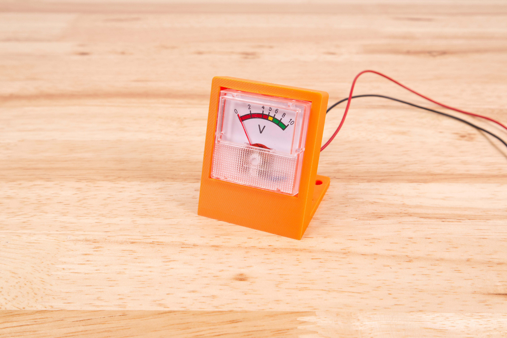
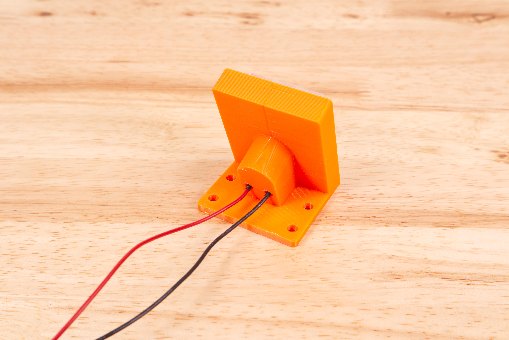
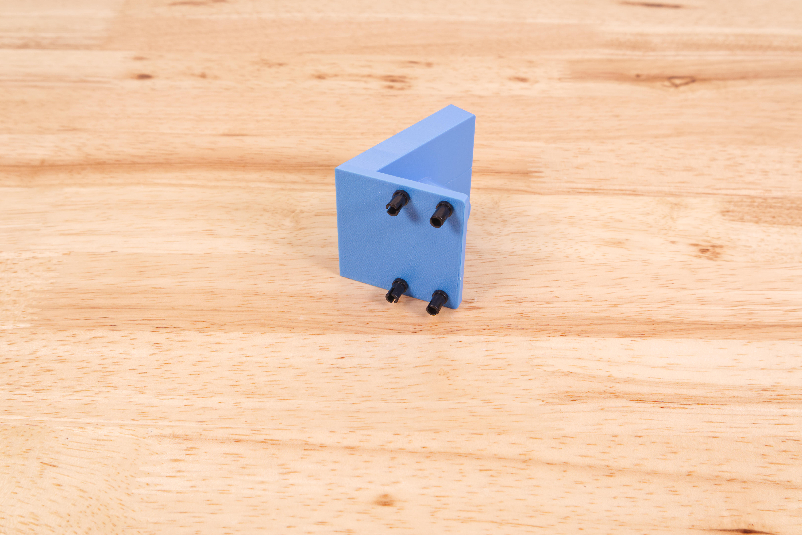
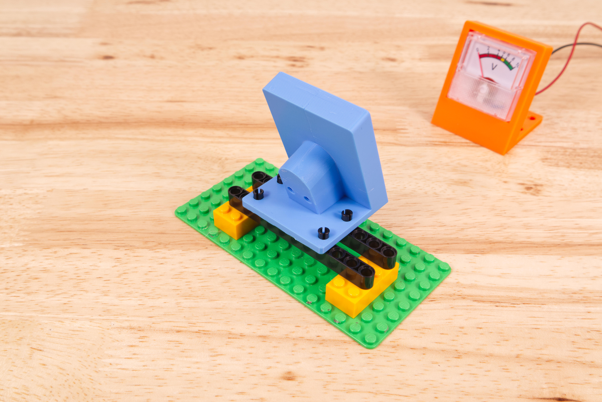
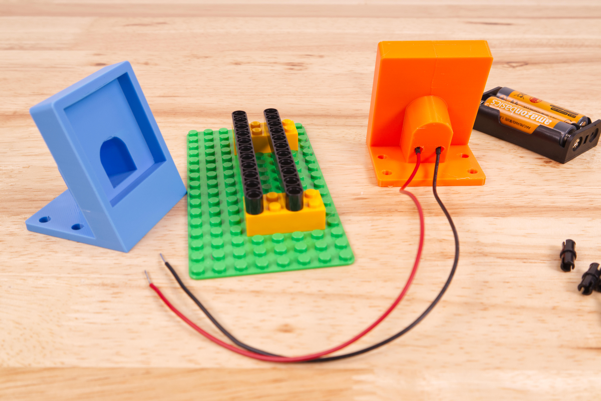

# Voltmeter Holder

This is a desktop holder for the analog voltmeter we us in some of our kits.

There are holes on the base that allow you to attach it to LEGO Technic Beams using LEGO Technic Pins.

The holes can also be used to attach the mount to surfaces using screws, zipe ties, or wire ties.

This file can be printed on a standard FFF (Fused Filament Fabrication) desktop printer without support.

---

Brown Dog Gadgets

https://www.browndoggadgets.com/
